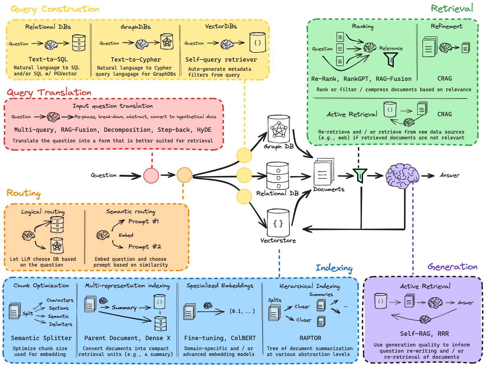
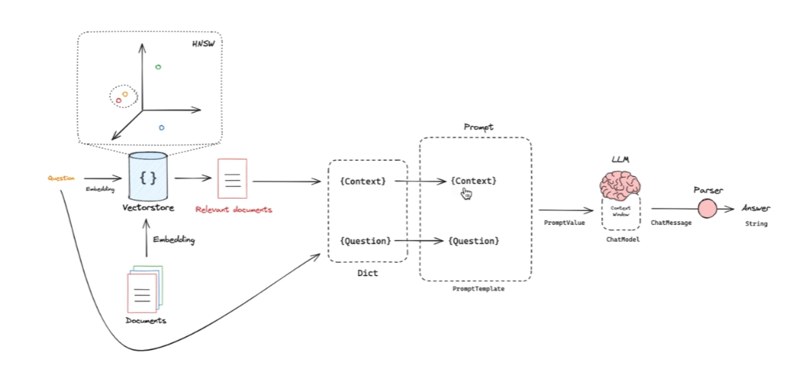
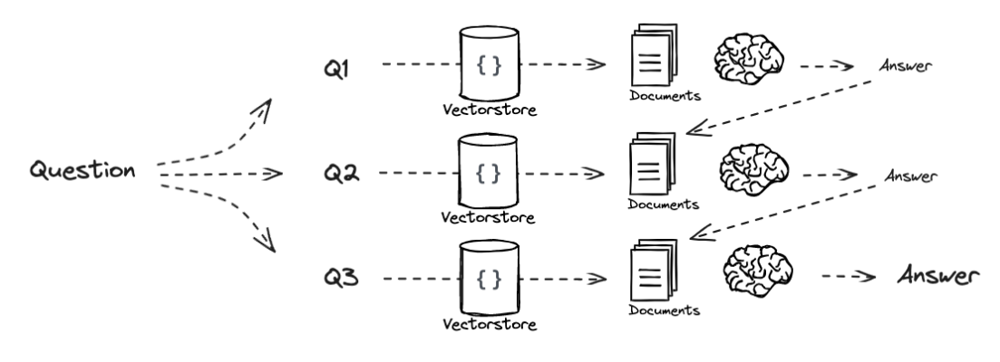
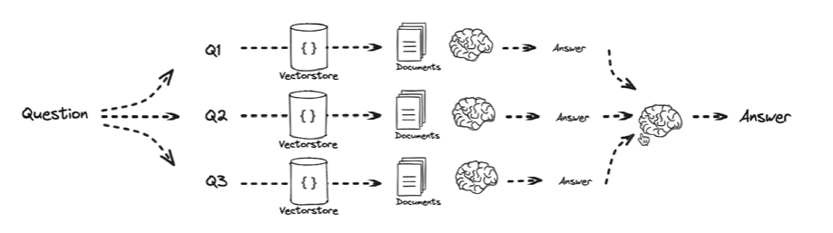
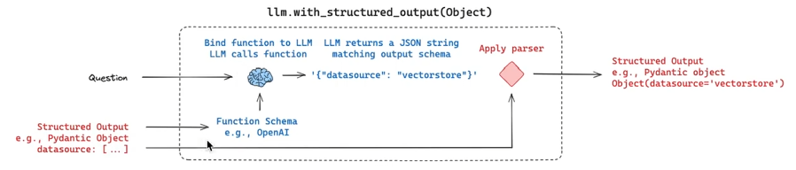
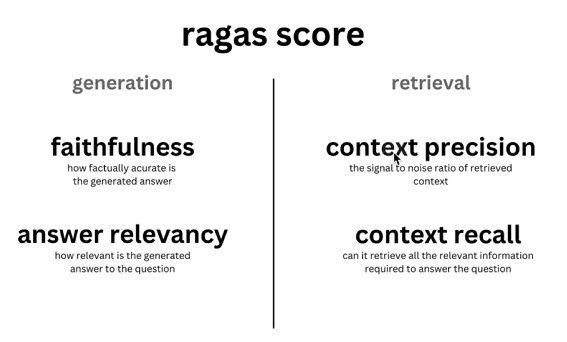

# RAG 学习

基于[该系列视频](https://www.bilibili.com/video/BV1dm41127jc)做的笔记。

## Overview

最简单的 RAG 包含三个步骤：Indexing、Retrieval、Generation

**Indexing**

如何将数据转换为向量？

- 通过 Embedding Model 转换。维度空间越高，向量越精确。

如何对向量进行管理与检索？

- 使用向量数据库。

建立向量索引的算法

- HNSW（[翻译](https://zhuanlan.zhihu.com/p/673027535)、[原文](https://www.pinecone.io/learn/series/faiss/hnsw/)）

判断向量的相似度

- 根据对应 LLM 官方的推荐方法计算，例如 [OpenAI](https://platform.openai.com/docs/guides/embeddings) 推荐余弦相似度计算。

**Retrieval**

检索出数据，将相关文本块套入提示词模板。

**Generation**

将提示词发送给 LLM 获取响应内容。

**举例**

将数据存入向量数据库

从向量数据库中检索数据

## Query Translation

根本目的是为了提升相关文本块的命中率，希望能够检索到更多内容。

https://chatgpt.com/s/t_6865276fc3388191b2cf46301dc5845f

五种优化方式

### Multi-query

多查询

基于原始问题，生成多个不同版本、不同视角的新问题。

### RAG-Fusion

Multi-Query 的增强版，对检索结果进行重排序。

### Decomposition

问题分解

将一个复杂的问题拆解为若干个子问题。子问题间可以是递进关系，也可以是独立关系。

递进关系

独立关系

### Step-back

退一步思考

基于当前问题，问一个更基础的问题。

### HyDE

Hypothetical Document Embeddings、假设性文档嵌入

基于原问题生成假想的文档内容，再根据假想的文档内容去 Retrieval 相关文本块。

## Routing

### Logical routing

并不是所有数据都适合基于向量存储语义化查询。对于结构良好的问题，传统的关系型数据库、图数据库等，查询效果显然更好。

例如“LangChain 在 2024 年之后发布的访谈视频”，结构良好。

所以需要判断原始问题更适合哪种查询方式。对于结构良好的问题，应当从关系型数据库中查询。对于结构不良的问题，从向量数据库中语义查询。

### Semantic routing

例如，系统中有很多内置的提示词模板，需要根据问题选择合适的提示词模板。

如何选择提示词模板？

将提示词模板与问题转换为向量，对比问题与各个提示词模板间的相似度，选择相似度最高的模板。

## Query Construction

这块知识与 Logical routing 衔接。

用户输入的是文本，但是不同数据库有不同的查询语言。

例如关系型数据库使用 SQL，图数据库使用 Cypher，向量数据库也有高阶的 metadata 用法。

如何将文本转换为对应的查询语言？

- 结构化输出（Structured Outputs）

如何实现？

- LLM 的 Function Call
- 提示词（没有前者稳定）

LangChain 中提供了结构化输出的专用方法：`with_structure_output`

`with_structure_output` 背后做了哪些事？

定义好数据格式（例如 Python 中的 Pydantic Object），将 Schema 传给 LLM Function Call，从而输出稳定的指定 Schema 的数据格式。

## Indexing

Retrieval 前最重要的点：如何更好地将原始数据存储进数据库？

四种方式

### Chunk Optimization

**最简单**的方式，根据语义化存储。

优化点：如何切片？
- 例如纯文本，按照段落；markdown，按照标题；代码块，按照特殊标识等等。

### Multi-representation indexing

原始数据并不只有文本格式，还有图片、表格等格式。

为了解决该问题，LangChain 与 Unstructured 进行合作。

- [Unstructured](https://unstructured.io/)：是一个专为生成式 AI（GenAI）设计的企业级数据处理框架，核心功能是将复杂的非结构化数据转化为干净、结构化的数据。

例如用户传入一个 pdf，解析器先从 pdf 中将图片、表格、文本等数据分类提取出来。一方面存储到数据库中，另一方面通过大模型为数据生成文本概要，同时为二者建立映射。当 Retrieval 时，再将概要与对应数据提取出来，生成 AI 响应。

[链接](https://blog.langchain.com/semi-structured-multi-modal-rag/)

### Sepcialized Embeddings

使用特定领域的 Embedding 模型。

### Hierarchical Indexing

核心思路：原始有很多文档，对文档进行聚合，再聚合，直到只有一个文档。构建为一棵树（这个就与传统的索引有些类似了，打到一个节点，根据节点与其他节点的关联寻找其他数据信息）。将所有文档存储进向量数据库。

优点

1. 增加了相关文本的命中率。（前面将原始问题拆分为多个问题相当于子弹变多，该优化相当于靶子变多。）
2. 使 RAG 能够更好地做总结性内容。（之前的 RAG 更倾向于处理一个或多个文本段落中的具体问题，如果原始文本间关联度低，不适合做所有文本的知识总结。）

## Retrieval

### Ranking

重排序，对初次检索出的相关文档进行二次排序。

- Re-Rank
    - 使用专业的重排序模型进行重排序。

- RankGPT
    - 使用 GPT 模型进行重排序。

### Active Retrieval

主动检索

最后检索出来的结果可能与原始问题并没有太大关系。

如果关联度过低，则使用 Web Search 增补相关文档。

## Generation

Self-RAG

基于最后生成的结果进行打分，如果分数过低，反思哪里做的不好，基于结果再次触发检索，重新生成回答。

## Other

如何做 RAG 的评估？

使用 Ragas 框架。

评估维度？

