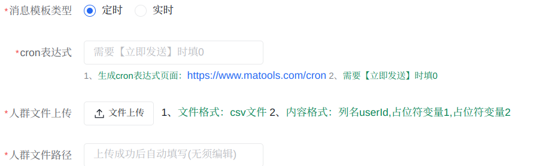
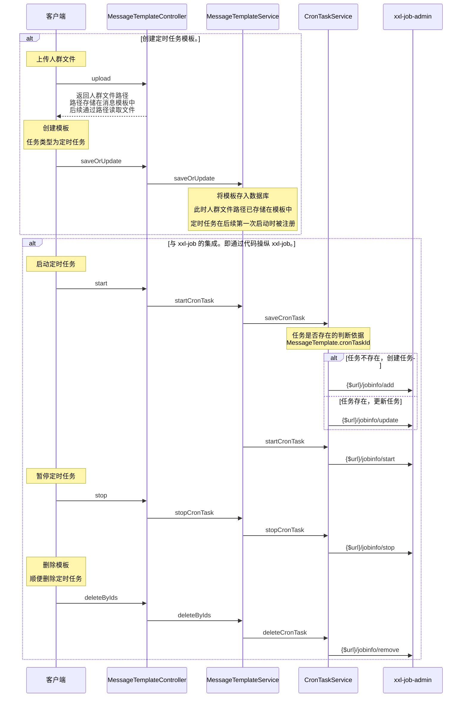
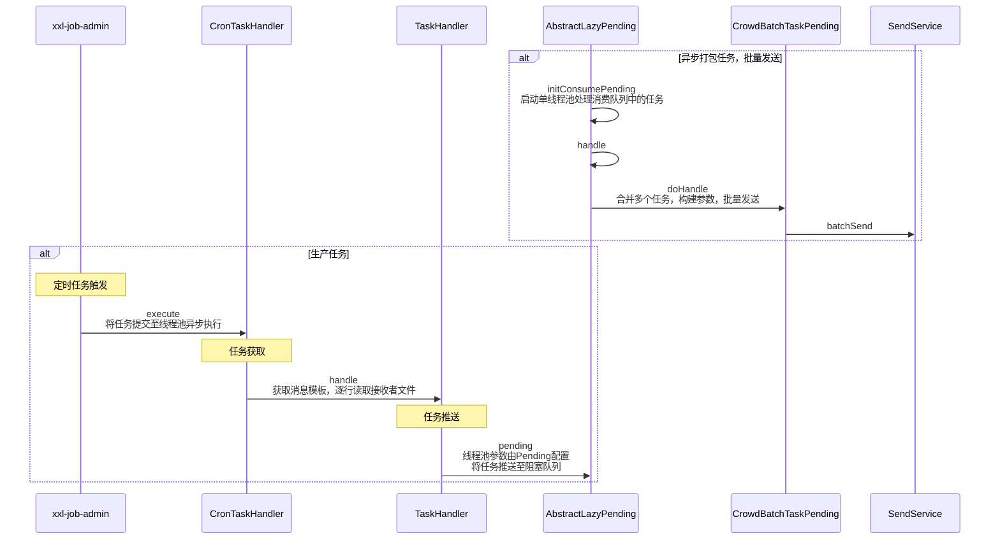
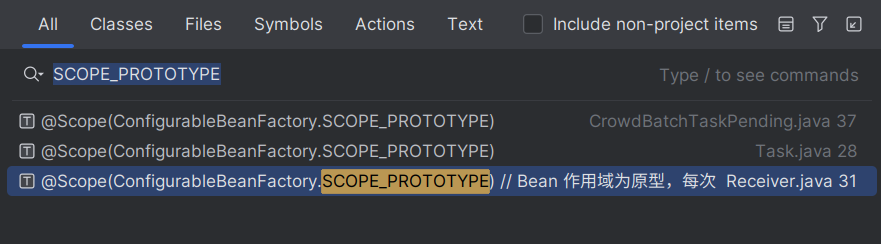

# 定时任务

## 技术选型

SpringTask，@Schedule 注解，且支持 cron 表达式。缺点：单机模式。

Quartz，有集群部署方案，但是 API 有些复杂，且不支持很多高级功能。

所以使用 XXL-JOB。

关于分布式定时任务的实现原理。看看文档的 3.29 介绍。几个角色。

关于 XXL-JOB 的架构设计。看看互联网上的资料。

定时任务常见应用场景：

- 定时推送消息
- 定时扫表更新状态
- 定时更新数据

## 简要说明

定时任务相当于实时任务的拓展。

所以定时任务相比与实时任务，实现上多了哪些东西？

如图，创建定时任务的模板时，需要指定 cron 表达式与人群文件路径。

- 程序提供了上传人群文件的接口：`MessageTemplateController.upload`，上传文件后会自动填充路径。

随后，cron 表达式与人群文件路径作为 `MessageTemplate` 的两个参数，存储进数据库中。

- “cron 表达式”在创建 XXL-JOB 中的定时任务时，作为参数传入。
- “人群文件路径”在定时任务执行时被读取。

定时任务执行的最后，调用 `SendServiceImpl.batchSend`，进入接入层，执行后续逻辑。

## 业务集成

需求：

1. 创建定时任务模板：需要存储 cron 表达式与人群文件路径。
2. 与 xxl-job 的集成：消息推送平台需要动态增删改定时任务，在代码内集成，而非可视化配置页面。所以自己封装 XXL-JOB 调度器的 HTTP 接口。
    - 实现方式：Hutool HTTP 模块的工具类，请求调度器暴露的 HTTP 接口。

时序图：

> `deleteByIds` 并没有真正从数据库中删除模板，而是将模板状态更新为“已被删除”，将更改保存进数据库。
>
> 自己的疑惑在于，并未看到系统对该数据后续有何处理。
>
> - 难道是直接通过数据库恢复已被删除的模板吗？

其他：

`XxlJobInfo` 是与 xxl-job-admin 接口进行交互所需的配置信息，封装为类，方便操作。

`XxlJobInfo.scheduleConf` 存储任务的调度配置，通常是 cron 表达式。

注：

xxl-job 的封装不够好，很多参数（例如任务调度类型（如 cron）、任务路由策略（如轮询））都需要手动封装为 JavaBean。xxl 包下的一些类做的就是这些事情。

（看看 xxl-job 新版本有没有支持更方便的 api 调用。这玩意不应该呀，好麻烦。）

（设置 cookie 之类的东西，然后就能通过 hutool 的 HttpUtil 直接调用接口，这基本就是所有网站的本质了，脚本也基于此而成！不忘初心（自动写作业脚本））

（还有，austin 中 xxl-job 的封装就相当于 HttpClient 的最佳实践吧。“配置”与“常量”的思想。）

## 具体执行逻辑

> 定时任务的具体执行逻辑。

点击启动后，会触发定时任务 `CronTaskHandler`。

随后是三个线程池处理消息。

**为何如此设计？**

1. 逐行读文件：加入文件中有 100w 个接收者，同时处理会内存爆满，显然不可能。
2. 异步处理：读取磁盘文件并远程调用发送接口是一件比较耗时的工作，所以通过“线程池”异步处理。
3. 批量处理：一条条处理显然也不合适。内存队列 LazyPending，通过判断队列中消息积压的 size 或 timeout，解决接口调用过少或过多的问题。

将整个流程比做物流运输链路。

- 第一个线程池，相当于原材料供应商，每解析一行数据，生成一个“包裹”（`CrowdInfoVo`），通过“传送带”（阻塞队列）送往集货中心。
- 第二个线程池，相当于物流公司的集货中心，定量||定时将零散包裹打包成箱。
- 第三个线程池，相当于运输车队，将整箱货物运往目的地。

**时序图**

**文字描述：**

- 处理多个定时任务，`CronAsyncThreadPoolConfig.getXxlCronExecutor`
    - 读取 CSV 文件，逐行解析接收者信息。
    - 将每行数据封装为 `CrowdInfoVo` 对象，提交至阻塞队列。

- 消费单个定时任务的阻塞队列，`SupportThreadPoolConfig.getPendingSingleThreadPool`

    - 轮询阻塞队列：通过 poll 方法从阻塞队列取出任务，累积到 tasks 列表。
    - 触发消费条件：检查是否满足数量阈值或时间阈值。
    - 提交任务：当满足条件时，将 tasks 列表批量提交给第二个线程池异步处理。
- 实际发送阻塞队列中的任务，`CronAsyncThreadPoolConfig.getConsumePendingThreadPool`
    - 合并请求，调用批量发送接口。

**问题：如果有多个定时任务怎么办？（同时自己认为代码实现有问题）**

三个线程池分别只有一个，但是 `CrowdBatchTaskPending` 是多例的，需要为每个定时任务创建一个对应的处理类，使每个定时任务拥有自己的阻塞队列与 tasks 列表。

**但是**，代码中的实现，线程池也被创建了多个。

第二个线程池有正常关闭的方法，第三个线程池没有找到，或许是bug？

线程池创建的初衷不就是为了避免线程的频繁创建销毁吗？

AI 说线程池属于重量级资源，应当常驻前台，与整个应用同周期。

个人认为应当将线程池设置为单例，处理类为原型模式没问题，同时应对多个定时任务，但是线程池应当只有一个！

**其他**

需要额外注意 Bean 的作用域为原型的类。

**其他**

> （线程池要不写简历上？反正 austin 项目中涉及到了，肯定会被问到。）
>
> JavaGuide：线程池的一些知识点，如何创建？三个核心参数，阻塞队列。
>
> 黑马讲的还是不错的，手写线程池。
>
> austin 调用的 hutool 的工具类，创建线程池。
