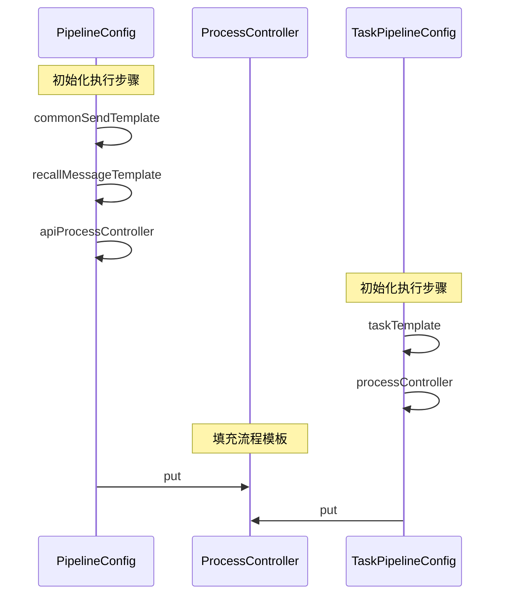
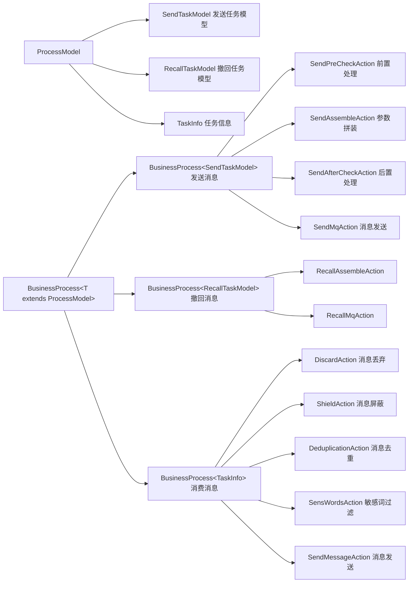

# 接入层

## 责任链模式

什么是责任链模式？

[讲解链接](https://mp.weixin.qq.com/s?__biz=MzI4Njg5MDA5NA==&mid=2247486593&idx=1&sn=c6f1ed857d1f60fec8575f19b3e46e6c)

初始化

执行

- 发送消息：`SendServiceImpl.send` -> `ProcessController.process`
- 撤回消息：`RecallServiceImpl.recall` -> `ProcessController.process`
- 消费消息：`Task.run` -> `ProcessController.process`

流程模板

## 前置检查

校验必填字段：过滤消息模板 ID 或 `MessageParam` 为空的情况。

过滤空接收者：过滤 `MessageParam` 中 `receiver` 为空的情况。

限制批量大小：过滤 `MessageParam` 中 `receiver > 100` 的情况。

- 后续的定时任务批量发送，虽然 CSV 文件中的 receiver 可以大于 100，但是在具体处理逻辑中，还是将 CSV 文件拆分为多个批次发送，每次不超过 100。

## 参数拼装

目的：组装 `TaskInfo` 中的 `ContentModel` 属性。

调用流程：`process` -> `assembleTaskInfo` -> `getContentModelValue` -> `ContentHolderUtil` -> `PropertyPlaceholddanerHelper`（Spring 中的工具类）

细节：通过工具类替换占位符后，将替换后的字符串通过反射映射到 `ContentModel` 中。

## 后置检查

确定校验规则：根据模板配置的 `idType`（手机号||邮箱）选取对应正则表达式。

过滤非法请求：根据正则表达式过滤非法的 `receiver`。如果某个批量发送任务的 `receiver` 被删空，则移除该 `TaskInfo`。