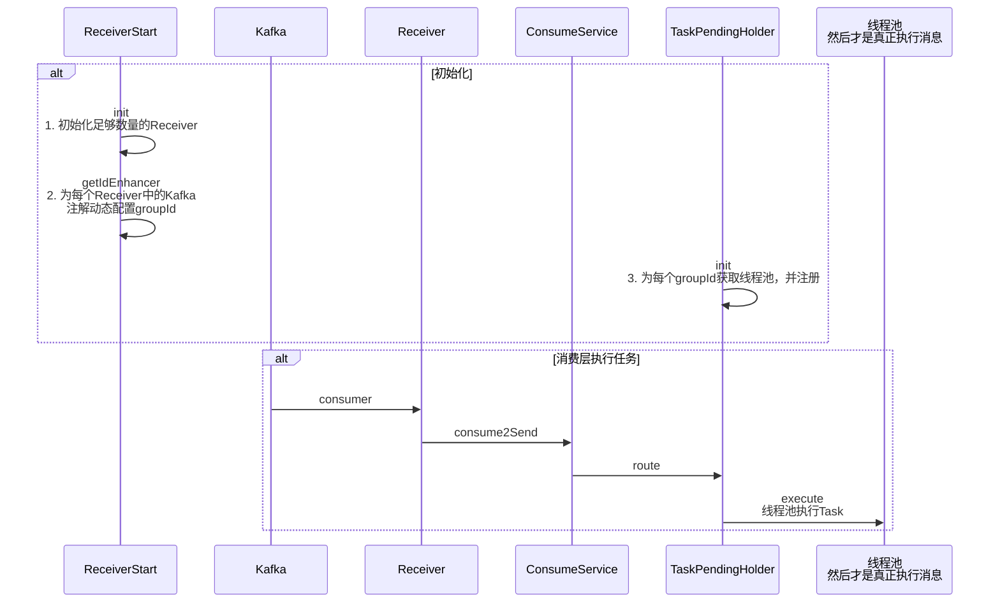

# 消息队列

## 数据隔离设计

如果数据不隔离，会发生什么？

- 当某个发送渠道接口异常时，所有消息都会被阻塞。

如何设计？

- 依据不同渠道、不同消息类型，设置不同的消费者组。

为什么设置不同消费者组，就能实现数据隔离？

- 每个消费者组会维护自己的消费偏移量（offset），一个组的消费进度不会影响另一个组。

疑惑：为什么共享 Topic 不会发生阻塞？

- Topic 本质是用来保存数据的，如果一个消费者组发生阻塞，只会导致 Topic 中该消费者组相关的消息堆积，其他消费者组仍能正常消费消息。
- 其实不是很理解 Topic 的内部原理，继续深入思考，还是有很多不理解的地方。比如为什么在有些消息堆积的情况下，其他消费者组仍能正常消费消息。

## 初始化

1. 初始化足够数量的 Receiver 实例。
2. 通过一个方法为每个 Receiver 对象中的 @KafkaListener 注解动态配置 GroupId。（**AOP 思想**）
3. 为每个 GroupId 获取线程池。（GroupId 充当线程池名称，便于消费任务时指定线程池。）

GroupId 设计：`ChannelType` + `MessageType`

- `ChannelType` 渠道类型枚举类。
- `MessageType` 消息类型枚举类。

如何获取 `TaskInfo` 的 `GroupId`？

- `GroupIdMappingUtils.getGroupIdByTaskInfo` 根据 `TaskInfo` 获取当前任务的两个类型，将二者组合，即为 GroupId。

## 执行任务

Kafka 单 Topic 多 Group，发布-订阅模型，每个 Group 都会接收到全量消息。

`Receiver.consumer` 为 Kafka 监听器，获取消息内容，解析消息的 GroupId，只消费与自己 GroupId 相同的消息，其余消息被过滤。（简单粗暴的方式。）

```java
@KafkaListener(topics = "#{'${austin.business.topic.name}'}", containerFactory = "filterContainerFactory")
public void consumer(ConsumerRecord<?, String> consumerRecord, @Header(KafkaHeaders.GROUP_ID) String topicGroupId) {
    // 获取消息内容
    Optional<String> kafkaMessage = Optional.ofNullable(consumerRecord.value());
    if (kafkaMessage.isPresent()) {
        List<TaskInfo> taskInfoLists = JSON.parseArray(kafkaMessage.get(), TaskInfo.class);
        // 解析消息的 GroupId
        String messageGroupId = GroupIdMappingUtils.getGroupIdByTaskInfo(CollUtil.getFirst(taskInfoLists.iterator()));
        // 只消费与自己 GroupId 相同的消息，其余消息被过滤
        if (topicGroupId.equals(messageGroupId)) {
            consumeService.consume2Send(taskInfoLists);
        }
    }
}
```

随后 `consumeService.consume2Send` 中，打印日志，创建任务实例，将每个任务路由到相应的线程池进行处理。

为什么 Task 是多例？

- Task 中有一个成员变量 TaskInfo。如果 Task 为单例，会导致严重的并发问题。例如线程 A 执行一半线程 B 进来了，导致线程 A 的 taskInfo 被覆盖。
- （难道前面都没有并发问题吗？要避免并发问题，需要保证各个类都是无状态的，即无成员变量。）

## 线程池

[Java线程池实现原理及其在美团业务中的实践](https://tech.meituan.com/2020/04/02/java-pooling-pratice-in-meituan.html)

`HandlerThreadPoolConfig`

## 时序图



## 问题

单 Topic 多 Group 不符合 Kafka 的最佳实践。每个消费者组都会接收全量消息，过滤大量消息，导致资源浪费。

正确做法：业务应当基于 Topic 隔离，多 Topic 多 Group。

> 怎么写？懒得重构代码了。就这样吧，手动过滤，虽然代码很烂，但是能跑，且不用后续思考。
