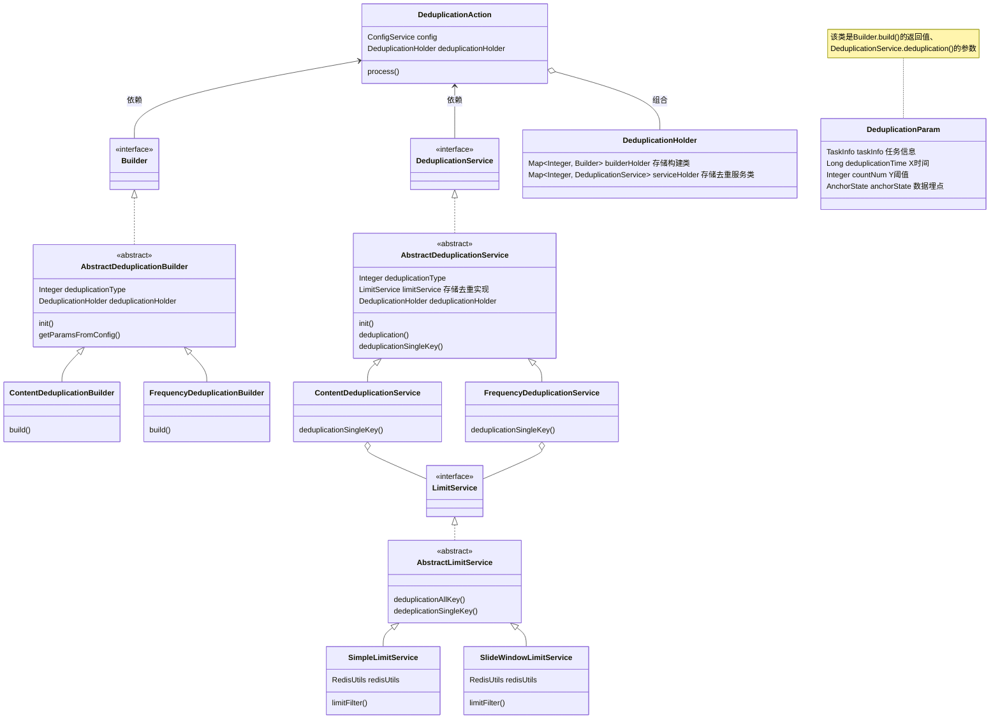
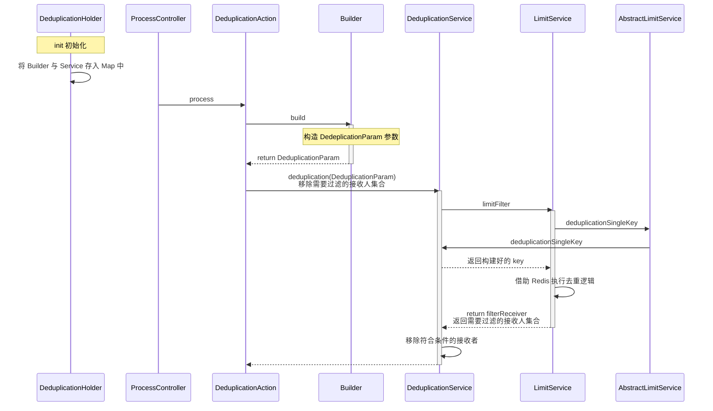

# 消费层

## 消息丢弃

- 配置：Apollo
- 实现：`ProcessContext.needBreak` 中断标识，设置之后，该 `ProcessContext` 直接被丢弃，不会走到最终的发送消息逻辑。
- 适用场景：
    - 当遇到消息积压时，可以主动丢弃非关键消息（如营销通知），优先保证高优先级消息的处理，从而降低队列积压。
    - 消息不小心发错了，希望趁消息在 MQ 积压的时候删除消息。

## 消息屏蔽

> 对应延时任务

- 实现：Redis List + xxl-job

## 消息去重

配置：Apollo

实现：简单计数 + 滑动窗口

[什么是去重、幂等？](https://mp.weixin.qq.com/s/E-pykbZRH5DP2DLvlrbhFQ)

### 业务分析

X 时间段内达到了 Y 阈值

- 5 分钟内用户如果收到相同内容，则过滤消息
- 一天内同一用户收到消息 5 次，则过滤消息

注：平台性功能，不与业务强挂钩

### 涉及到的类

`Builder`，构建去重参数 `DeduplicationParam`。

`DeduplicationService`，构建去重 key。

`Limit`，去重的具体实现。



### 执行流程



### 实现细节-内容去重-滑动窗口

> 内容去重，解决了 Kafka 重复消费的内容。

需求：若接收者 5 分钟内收到两条内容相同的消息，则进行去重。

构建 key：`md5(消息模板 ID + 接收者 + 消息内容)`。

具体逻辑：Redis Zset 数据结构 + Lua 脚本实现滑动窗口去重。

### 实现细节-频次去重-简单计数

> 防止恶意请求。

需求：若接收者一天内收到同一渠道超过 5 条消息，则进行去重。

构建 key：统一前缀 + 接收者 + 发送渠道

具体逻辑：

- Redis String 数据结构，存储用户当前计数。过期时间为当天。
- 去重判断：`MGET` 命令批量获取所有用户计数，过滤计数值 >= 5 次的用户
- 计数更新：根据当前请求，更新计数。
- 批量写入 Redis。

## 敏感词过滤

[敏感词过滤方案总结 JavaGuide](https://javaguide.cn/system-design/security/sentive-words-filter.html)

[208. 实现 Trie（前缀树） leetcode](https://leetcode.cn/problems/implement-trie-prefix-tree/description/)（该题常见解法是将节点成员变量设置为 26 大小的数组，为了支持中文，节点成员变量应当为 HashMap）

[字典树动画讲解 bilibili](https://www.bilibili.com/video/BV1ZtcBewEbJ)

### Trie实现

```java
import java.util.HashMap;
import java.util.Map;

public class Trie {

    public static void main(String[] args) {
        Trie trie = new Trie();
        trie.insert("高清视频");
        trie.insert("高清CV");
        trie.insert("东京冷");
        trie.insert("东京热");
        System.out.println(trie.search("高清视频")); // true
        System.out.println(trie.search("东京凉")); // false
        System.out.println(trie.search("东京")); // false
        System.out.println(trie.startsWith("东京")); // true
    }

    private TrieNode root;

    public Trie() {
        root = new TrieNode(); // 创建根节点
    }

    // 字典树的一个子结点
    private class TrieNode {
        Map<Character, TrieNode> children; // 存储子结点
        boolean isEnd; // 标记单词

        public TrieNode() {
            children = new HashMap<>();
            isEnd = false;
        }
    }

    // 插入单词
    public void insert(String word) {
        // 根节点
        TrieNode node = root;
        // 遍历字符串长度
        for (int i = 0; i < word.length(); i++) {
            // 获取字符串的每个字符
            char c = word.charAt(i);
            // 如果子节点不存在，新建节点并存入哈希表
            if (!node.children.containsKey(c)) {
                node.children.put(c, new TrieNode());
            }
            // 移动到子节点
            node = node.children.get(c);
        }
        // 标记单词结束
        node.isEnd = true;
    }

    // 检查单词是否存在
    public boolean search(String word) {
        TrieNode node = searchPrefix(word);
        return node != null && node.isEnd;
    }

    // 检查是否存在指定前缀
    public boolean startsWith(String prefix) {
        TrieNode node = searchPrefix(prefix);
        return node != null;
    }

    // 查找前缀的最后一个字符节点
    // 找到，返回节点；没找到，返回 null
    private TrieNode searchPrefix(String prefix) {
        TrieNode node = root;
        // 遍历字符串的每一个节点
        for (int i = 0; i < prefix.length(); i++) {
            char c = prefix.charAt(i);
            // 如果子节点不存在，返回 null
            if (!node.children.containsKey(c)) {
                return null;
            }
            node = node.children.get(c);
        }
        return node;
    }
}
```

### 项目应用

为什么不使用第三方库呢？比如 Hutool。

`SensWordsAction`：重点是 filter 方法，将敏感词替换为 *。其中敏感词存储在 Redis 中，通过 `RedisTemplate` 获取。

`SensitiveWordsConfig`：敏感词相关的初始化配置，通过 Spring 的 `ResourceLoader` 加载 `classPath` 下的敏感词文件，将其保存在 Redis 中，通过 `Spring TaskExecutor` 定时刷新加载敏感词。（为什么不弄成 Apollo 动态配置？）

## 限流

- 配置：Apollo
- 实现：单机限流，令牌桶算法，Guava 下的 RateLimiter 工具类。

### 什么是限流？

刚开始一直无法理解令牌桶算法，或许是因为自己对限流的误解。

限流的目标是控制长期平均请求速率不超过阈值，而不一定要严格控制每一时刻的“瞬时速率”。

- 比如滑动窗口，可能在一个窗口最初的 1ms 就处理了所有请求，随后的 1s 一直在阻塞。

### 演进1

简单计数策略 -> 滑动窗口策略 -> 漏桶算法

这三个算法的演进，**一步步消除了流量的“毛刺”问题**，使流量能够均匀分布。

### 演进2

漏桶算法保证了恒定的“处理速率”，但是面对“短期突发流量”，请求会在漏桶中排队，导致请求延迟显著增加。

令牌桶算法解决了这个问题，允许处理“短期突发流量”，同时也能确保长期的平均请求速率在限流范围内。

- 原因：因为上限是由令牌生成速率决定的，能够应对突发流量是因为“预存资源”。
- 长期平均负载 - 令牌生成速率；短期突发负载 - 桶容量。

漏桶算法 -> 令牌桶算法，相当于**从“严格限制”到“灵活控制”的演进**过程。

### 演进2诞生的原因

现实世界的请求很少是均匀分布的，通常会有波峰波谷。漏桶算法在请求波峰时强制将其压平，“削峰填谷”；令牌桶算法巧妙地将“资源消耗”与“资源恢复”解耦，“预存资源”，做到波峰波谷的动态调整。

- “消息队列异步处理秒杀“ 与 ”限流“ 还是有所不同的，比如前者就是异步处理，并不需要考虑响应延迟，而后者就需要考虑。（重点：**延迟敏感度**。消息队列起的应当是缓冲作用，而非流量控制。）
- 限流的应用场景一般是什么？？？
    - API 请求限流。毕竟消息推送平台也算是一个 API 提供平台。
    - 为什么要进行 API 请求限流？
        - 防止服务雪崩，压垮数据库。


问题：消息推送平台中的令牌桶算法是如何处理未获取令牌的请求？

