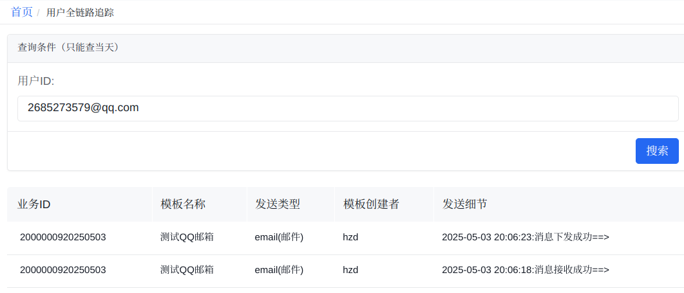
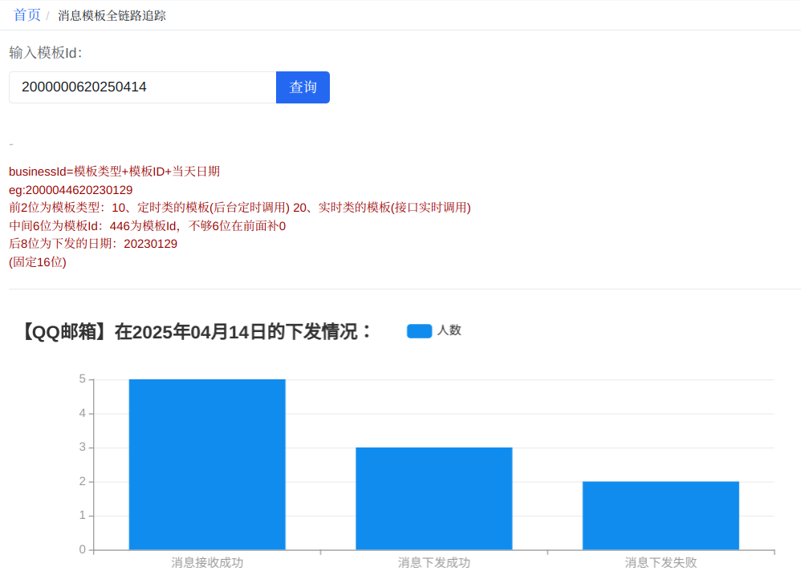
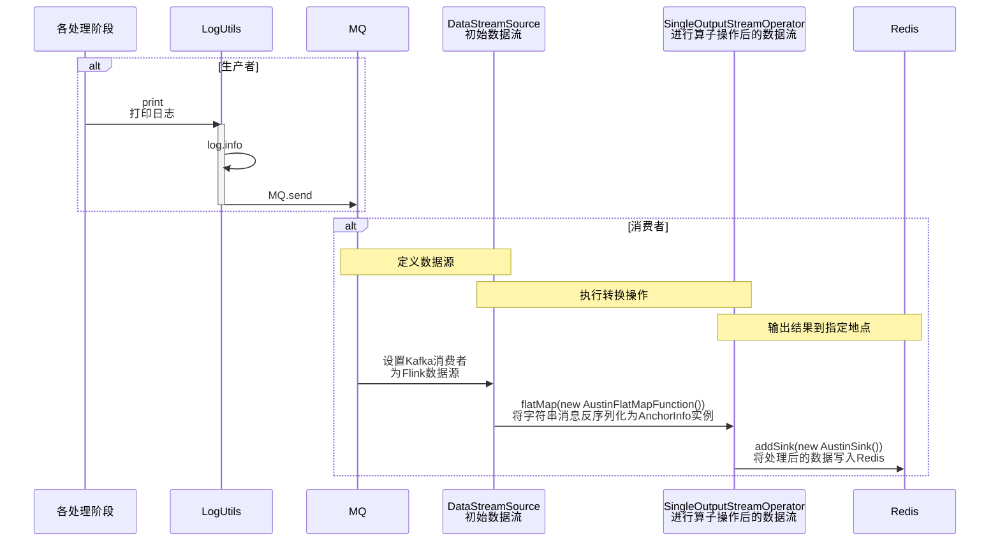
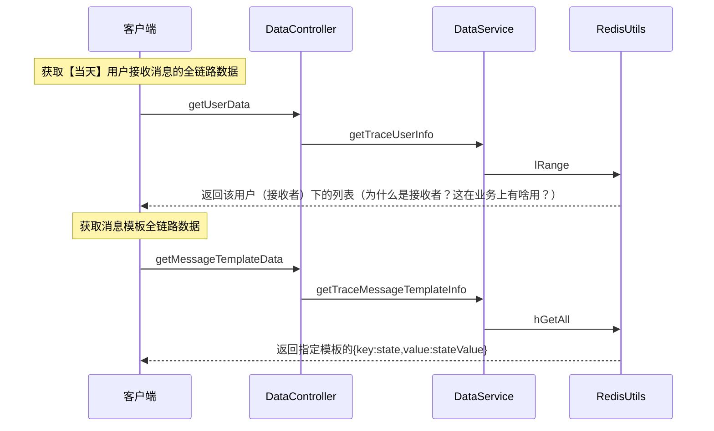

# 链路追踪

## 业务分析

一位用户当天的消息链路追踪。

当用户反馈时，能够由此查询到指定用户的消息下发细节，定位问题，给出回应。

一个消息模板在某一天的下发情况。

能够查看指定模板的消息下发成功率，判断消息模板是否出现问题、本次消息推送的影响情况等，为下发失败的用户做消息补发。

## 设计

存数据：获取原始数据，通过一系列加工，写入 Redis。

- 在执行任务的关键阶段进行埋点 -> 将埋点信息发送至 Kafka -> Flink 从 Kafka 数据源接收消息 -> FlatMap 算子将埋点信息反序列化为 `AnchorInfo` 对象 -> 在 Sink 输出阶段将数据组装为业务需要的格式 -> 通过 Redis 客户端将数据写入 Redis。

用数据：向使用者提供可视化界面。

- 设计对应接口，从 Redis 读取数据。

## 埋点

| 埋点 | 信息                            | 涉及的类                                                     |
| ---- | ------------------------------- | ------------------------------------------------------------ |
| 10   | 消息**接收**成功                | `ConsumeServiceImpl`                                         |
| 20   | 丢弃消息                        | `DiscardAction`                                              |
| 22   | 消息被夜间屏蔽                  | `ShieldAction`                                               |
| 24   | 消息被夜间屏蔽，次日早上9点发送 | `ShieldAction`                                               |
| 30   | 消息被内容去重                  | `ContentDeduplicationBuilder` -> `AbstractDeduplicationService` -> `ContentDeduplicationService` |
| 40   | 消息被频次去重                  | `FrequencyDeduplicationBuilder` -> `AbstractDeduplicationService` -> `FrequencyDeduplicationService` |
| 60   | 消息下发成功                    | `BaseHandler`                                                |
| 70   | 消息下发失败                    | `BaseHandler`                                                |

当任务执行到关键阶段，调用 `LogUtils.print` 记录日志，构造埋点信息（`AnchorInfo`），并将 `AnchorInfo` 序列化为 JSON 发送至 Kafka 指定 Topic 中。

`AnchroInfo`

- 一些标识任务的 ID
    - `messageId`：`IdUtil.nanoId()`，生成随机字符串。
    - `businessId`：模板类型 + 模板ID + 当天日期。
    - `bizId`：看代码，应当与 `messageId` 是一个东西，不清楚作者的意图。
- `Set<String> ids`：该消息任务的接收者。
- `state`：埋点。
- `logTimestamp`：日志生成时间。

## 时序图-存数据

写日志 -> Kafka -> Flink -> Redis

文字描述：

- `AustinBootStrap.main` 启动类。
- `MessageQueueUtils` 配置 Kafka 的消费者，并返回一个 `KafkaSource` 实例，用于流处理框架读取 Kafka 消息。（`KafkaSource` 是 Flink 中提供的对象）
- `AustinFlatMapFunction` 将从 Kafka 读取到的字符串数据转换为 AnchorInfo 对象
- `AustinSink` 将处理后的数据写入 Redis。
- `LettuceRedisUtils` 封装了与 Redis 的交互。

## 时序图-用数据

前端 -> Redis

