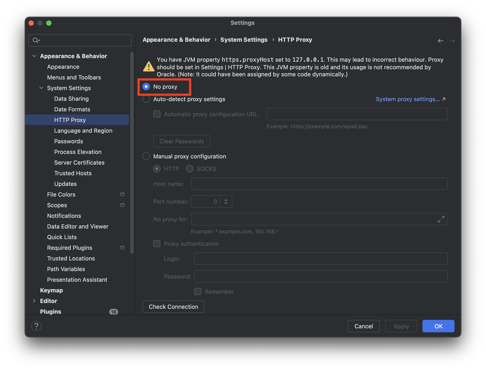
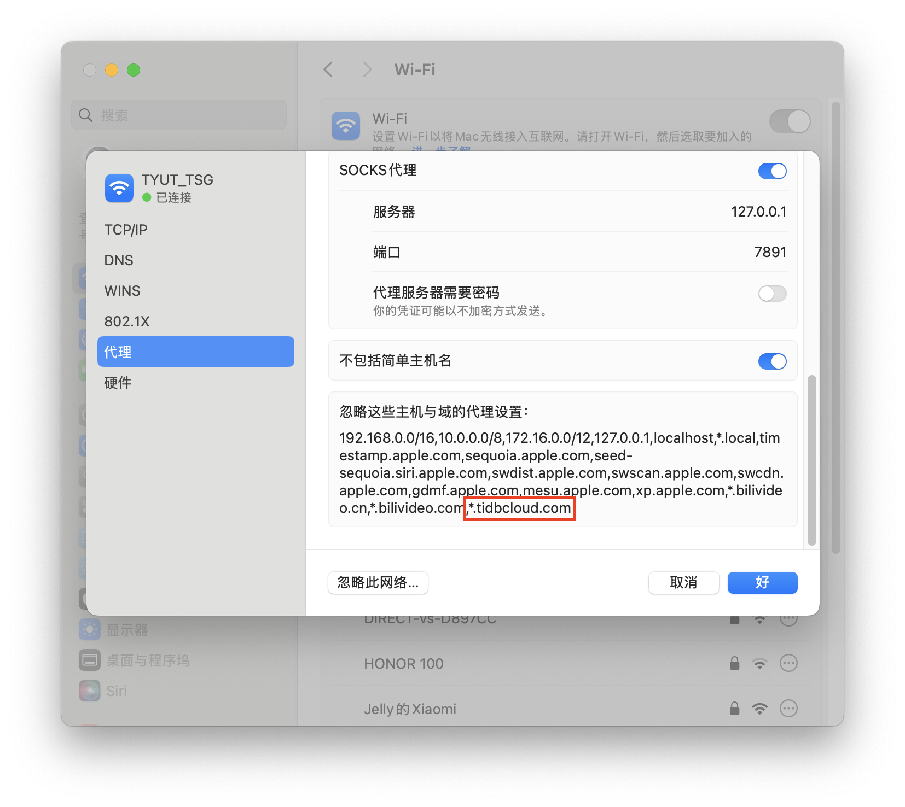

# 记录代理与云数据库冲突问题

## 问题

尝试使用 IntelliJ IDEA 中自带的数据库工具连接 TiDB Cloud，发现连接永远超时。

## 解决

自己习惯了代理常驻后台，因此下面的解决方法是以代理常驻后台为前提的。

第一步：IDEA -> Setting -> 搜索 HTTP Proxy -> 选择 No Proxy

第二步：让代理忽略 `*.tidbcloud.com` 域名的流量

通过这两步完全绕过代理后，即可连接成功。

## 分析

由于自己此前完全不了解相关知识，GUI 对 AI 也不够友好，因此解决问题的过程中，自己充当的作用其实是 AI 的人肉 Tool Calling。

AI 提供了一个测试程序，通过测试程序，发现连接阻塞的原因是服务端发送的 MySQL handshake 丢失。

MySQL 驱动远程连接的原理是，先建立一条 TCP 连接，随后在 TCP 连接中传输 MySQL 私有协议。TCP 连接建立后，第一条数据包就是服务端向客户端发送 MySQL handshake。

为什么该数据包未被成功送达？原本客户端与服务端直接建立 TCP 连接，但是在代理参与的情况下，链路变为客户端 -> 本地代理 -> 中转节点 -> 服务端。目前只知道数据包在这过程中丢失，其余的内容还不清楚。

如果要甩锅的话，想到三个甩锅对象：

1. 墙。
2. GUI 的弊端，IDEA 并没有提供连接失败的详细日志。自己是通过让 AI 写测试程序，根据程序的完整终端报错信息，才定位到问题所在。
3. 自己计网和 OS 没学好。

想到之前使用 OpenAI SDK 连接 LLM 时，也会遇到代理导致的问题，通过 `pip install httpx[socks]` 解决。

## 总结

总之，本地 debug 的教训是：本地开发连接云数据库时，代理完全是副作用，需要绕过代理，直接建立 TCP 连接。
