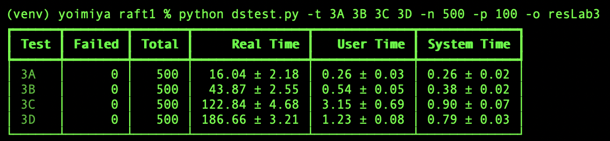
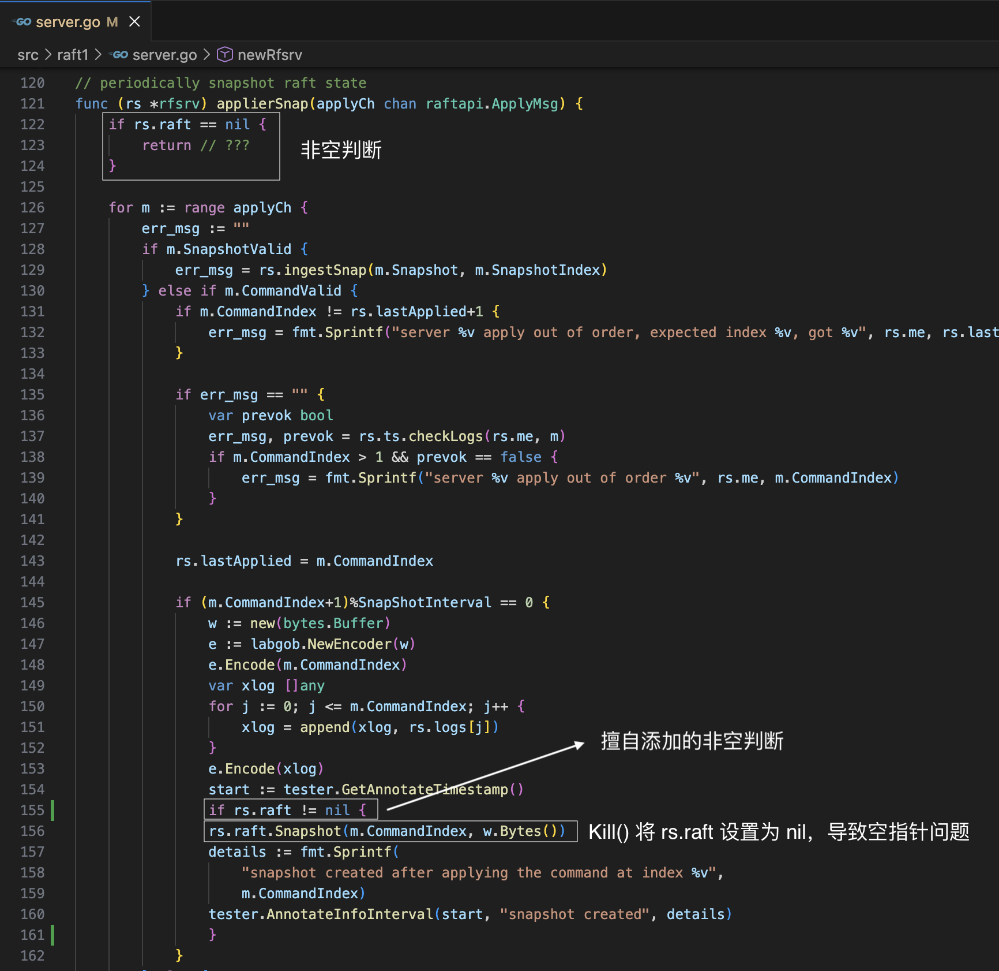

# Lab3 Raft

## 前言

Lab3 要求实现基本的 Raft 算法，以及加速日志回溯、快照两个优化。

- Lab3A 实现心跳机制与领导者选举
- Lab3B 实现追加日志
- Lab3C 实现持久化
- Lab3D 实现快照机制

耗时 21 天完成，测试 500 次没问题。



文章记录了自己的实现思路和遇到的问题，希望能够帮助他人。

在做 Lab 前，一定要阅读课程指导中的 [Raft Locking Advice](https://link.zhihu.com/?target=https%3A//pdos.csail.mit.edu/6.824/labs/raft-locking.txt)**、**[Students' Guide to Raft](https://link.zhihu.com/?target=https%3A//thesquareplanet.com/blog/students-guide-to-raft/)**、**[Debugging by Pretty Printing](https://link.zhihu.com/?target=https%3A//blog.josejg.com/debugging-pretty/) 三篇文章。第一篇文章讲述如何使用锁；第二篇文章讲述一些常见的问题；第三篇文章讲述如何更好的打印日志以供调试。

Lab3 的一个重点在于如何合理调度后台线程，让不同任务有序协作运行，我的后台线程如下：

- 一个触发器线程：负责检查选举超时、触发心跳（异步）
- len(rf.peers) - 1 个复制者线程：负责触发追加日志、安装快照（同步，防止乱序，导致不一致问题）
- 一个应用者线程：不断将准备好的快照和日志发送给应用层

## Lab3A

https://zhuanlan.zhihu.com/p/1980381904319558576

## Lab3B

https://zhuanlan.zhihu.com/p/1978462959836624178

## Lab3C

持久化的实现很简单，Lab 使用内存模拟持久化存储。当需要持久化的状态发生变动时，调用持久化方法即可。

通过 TestFigure8Unreliable3C 测试需要实现加速日志回溯的优化，详细逻辑参考 [Students' Guide to Raft](https://thesquareplanet.com/blog/students-guide-to-raft/#an-aside-on-optimizations) 即可。

一个很容易产生的疑惑：为什么 commitIndex 和 lastApplied 这两个属性不需要持久化？

因为 Raft 论文默认状态机是易失的，例如键值数据库，如果宕机重启，需要进行重放。推荐看看[相关的知乎问答](https://www.zhihu.com/question/382888510/answer/2368632206)。

一个很容易的忽视的问题：代码框架提供的 RPC 调用方法并没有超时机制，如果服务器无响应，RPC 会永久阻塞。因此需要自定义超时失败机制。

## Lab3D

快照的实现可以分为两步：

1. 每个服务器收到保存快照的任务后，截断日志，持久化快照
2. 如果从节点过于落后，主节点为其发送快照 RPC

**截断日志**

我的实现中，条目存储在数组中，条目索引即为数组索引。

```go
entry := rf.logs[logicIndex]
```

因为快照的引入，需要截断日志，所以我需要将对原数组的访问都减去一个偏移量。

```go
entry := rf.logs[logicIndex - offset]
```

这样做太容易出错了，因此我将 rf.logs 封装起来，对外暴露方法，供外层使用

```go
entry := rf.logEntry(logicIndex)
func (rf *Raft) logEntry(logicIndex int) Log {
    if logicIndex < offset {
        panic()
    }
    return rf.logs[logicIndex - offset]
}
```

我不想重构代码，上面的做法是我的权衡。

我认为更优雅的实现应当使用有序哈希表，一种保证顺序存储和 O(1) 访问的数据结构。将条目索引作为条目结构体的一个属性单独存储，而不是将其与数组索引混在一起。

**判断是否需要发送快照**

根据 nextIndex 判断：每次调用 AppendEntries RPC 前，对比 nextIndex 与偏移量的大小，判断从节点日志是否过于落后以至于需要主节点为其发送快照。

**测试代码问题**

我觉得测试代码存在问题，server.go 中 applierSnap() 没有使用锁，中途如果 Kill() 函数将 rs.raft 设置为 nil，会导致空指针问题。想不到别的解决方法，擅自在测试代码中添加了非空判断。



## 反思

代码中，RPC 发送接收相关的函数，每个都有一百多行代码，很多注释。比起频繁写注释，更好的做法应当封装函数，用函数名代替注释。

11月16日开始做，12月27日完成，只有 21 天做 Lab，10 天应付学校的事情，10 天娱乐。还是太摆烂了……

