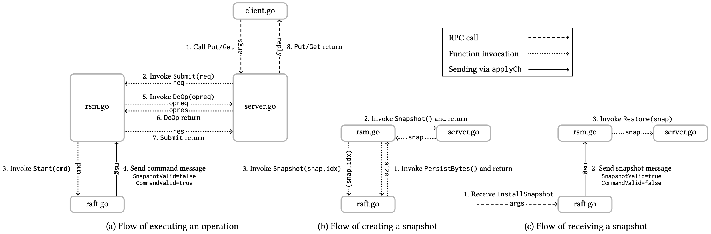
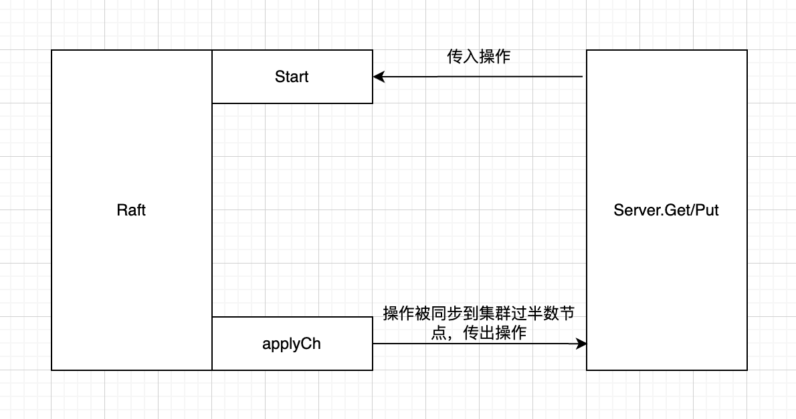
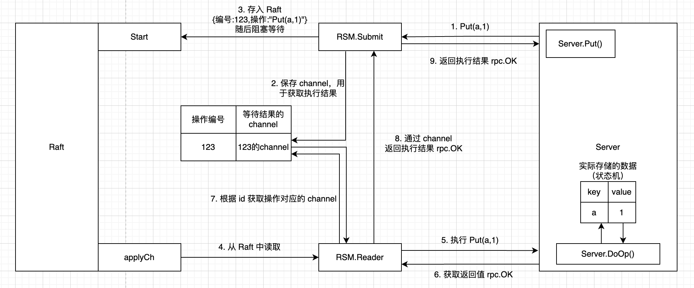
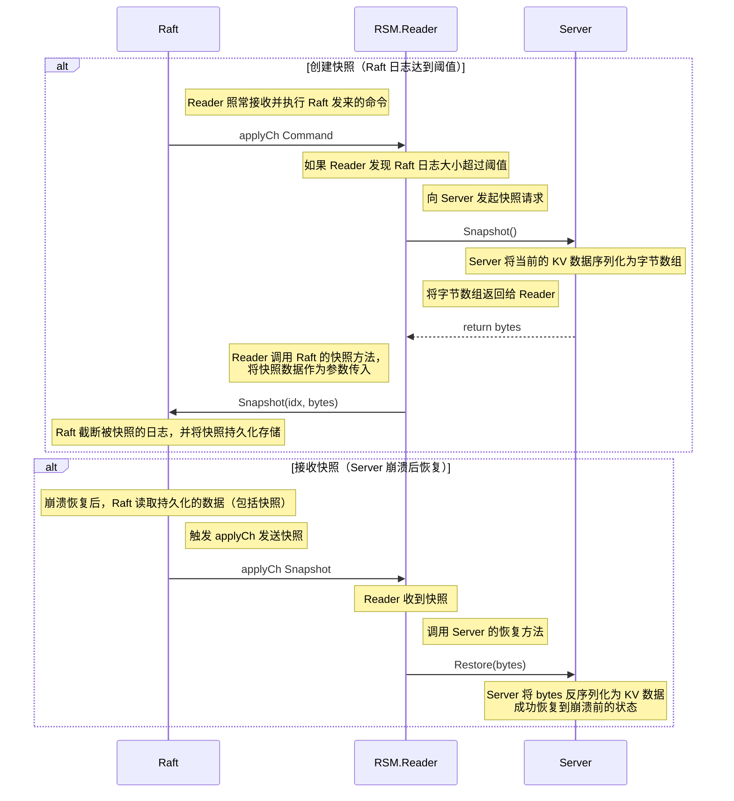

# Lab4 Fault-tolerant Key/Value Service

## 思路

Lab4 将 Lab3（Raft）与 Lab2（单机键值服务）联系了起来，实现一个容错的分布式键值数据库。

课程提供了一张很清晰的 [Raft 交互图](http://nil.csail.mit.edu/6.5840/2025/figs/kvraft.pdf)，这次的实验需要紧紧围绕这张图实现。

## 实现

### 复制状态机 - 概念

什么是复制状态机（Replication State Machine）？[维基百科的讲述](https://en.wikipedia.org/wiki/State_machine_replication)很清楚。

我觉得关键在于复制状态机是一个「确定性」的状态机，正如原文所述：

> 在本文中，状态机必须具备**确定性**：多个相同状态机的拷贝，从同样的“初始”状态开始，经历了相同的输入序列后，会达到同样的状态，并且输出同样的结果。

基于「确定性」前提，Raft 通过「复制状态机」实现了「分布式系统的容错」。

### 复制状态机 - 实现

Lab4A 其实是在解决一个问题：在多个客户端并发请求的情况下，如何实现复制状态机？[Students' Guide to Raft](https://thesquareplanet.com/blog/students-guide-to-raft/#applying-client-operations) 中对此也有说明。

先考虑最简单的情况。如果只有一个客户端请求，很容易想到下面这个结构：

但如果多个客户端并发请求，则会遇到两个问题：

1. 如何保证所有操作串行执行？
2. 如何把结果路由给发起请求的线程？

为了解决这两个问题，我的实现思路如下：

1. 维护一个 Reader Goroutine，监听 applyCh，读取 Raft 发来的命令，串行执行所有操作。
2. 维护一个 Map，key 为操作的唯一标识符，value 为 channel。发起操作的线程创建 channel，将 channel 存储在 Map 中并进行监听，等待执行结果的返回。
3. Reader 通过 Map 获取操作对应的 channel，将执行结果路由给发起操作的线程。

整体流程如下图所示：

### 无快照的键值服务

Client 与 Server 如何交互的核心逻辑在 Lab2 中已经实现了。

基于 Lab2 还需要解决两个问题：

1. 依据交互图，Reader 通过 Server.DoOp() 操作状态机。因此需要把原本在 Get()、Put() 中直接操作 KV 数据的逻辑整合到 DoOp() 中。
2. 如果 Client 请求到了一个不是 Leader 的 Server，Server 需要返回 ErrWrongLeader。Client 收到错误后，尝试请求另一个 Server，不断轮询，直到成功。

### 带快照的键值服务

KVServer 运行一段时间后，Raft 日志不断累积，不仅占用空间，而且崩溃重启的速度也会变慢。因此需要引入快照机制。

快照主要分为两个场景，创建与使用：

1. Raft 日志累积达到阈值，Server 需要创建快照，使 Raft 截断日志并持久化快照。
2. Server 崩溃恢复后，需要从 Raft 中读取快照，恢复数据到崩溃前的状态。

具体的时序图如下：

lab3

- 基本的 Raft
- 持久化（核心：类似 WAL，每当 Raft 需要被持久化的属性发生变化，就进行一次持久化）
- 快照（核心：快照和持久化的关系：快照是 Raft 的一个属性，也是要被持久化的。快照的具体内容是 server 层的 kv 数据）

lab2

- 版本号机制具体是什么，忘了
- 分布式锁怎么实现的，忘了

Guidance 中的很多内容也很实用，比如锁之类的东西

lab4 想要通过动画讲解，应该学一学怎么制作能够被插入到博客里的 Web 上的简易动画，就像 Hello 算法网站里的动画那样

lab5 听说比 lab3 还难，而且中间有好多论文呀

写 Lab 已经总结出经验了：

1. 先梳理思路，代码怎么写，每个文件需要什么线程，什么方法，什么结构体。它们直接如何进行协作。这是在写代码之前就需要搞清楚的东西。
    - 不仅是思路，程序、也就是代码的流程也要提前想清楚
2. 思路梳理清楚后，写代码事半功倍。
3. 报错了，自己痛苦 debug，或者 AI 偷懒解决。
