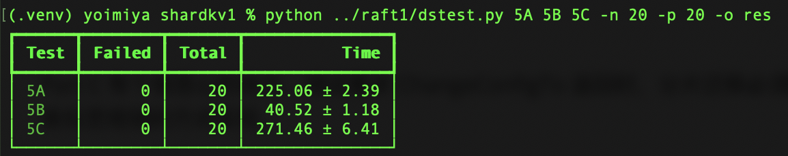
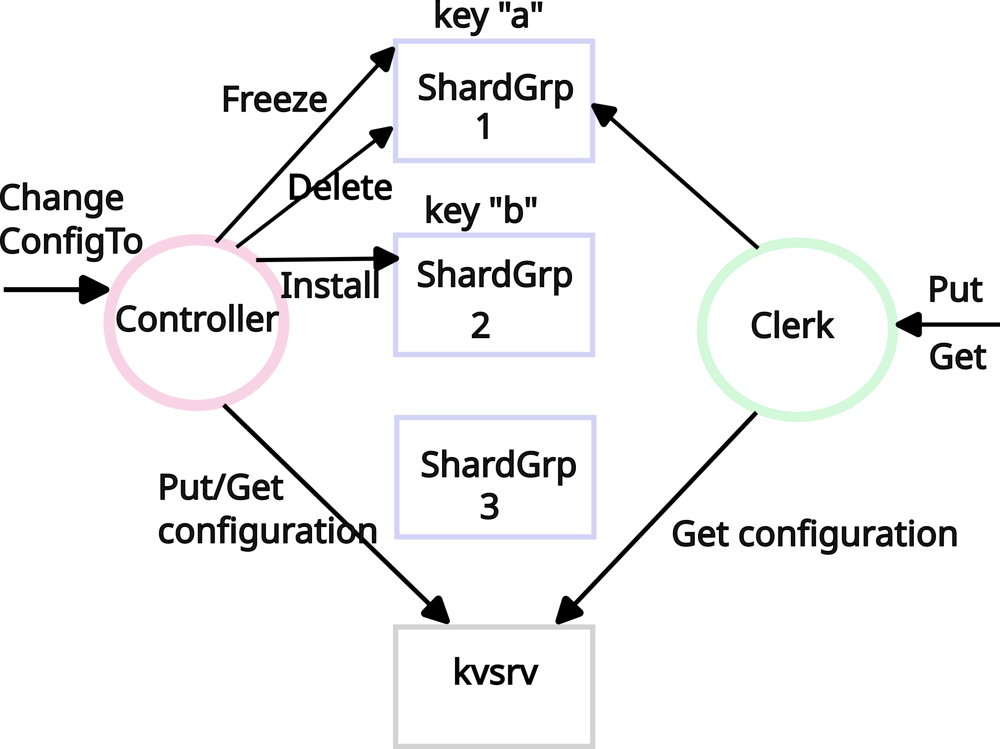
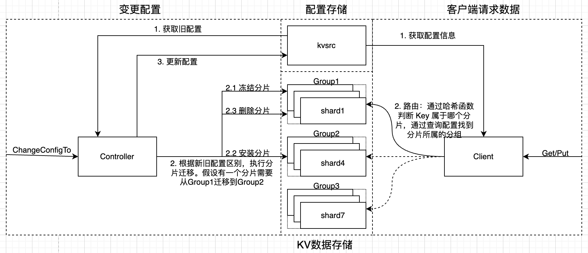
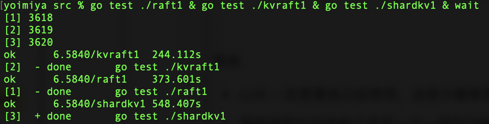

# Lab5 Sharded Key/Value Service

## 前言

Lab4 中实现的 KVStore 是无法横向扩展的，无论加多少台机器，系统的吞吐量都受限于 Leader 节点。

Lab5 将 KV 数据分片，分片被均匀存储到多个 Raft 集群中，系统的吞吐量可以通过成组添加 Raft 集群实现横向扩展。

个人认为 Lab5 难度仅次于 Lab3 Raft 的实现，在本 Lab 中又完整体会了一遍「想清楚程序流程 -> 自信且懒惰的不加日志写完代码 -> 运行的时候发现报错、死循环等各种问题 -> 痛苦加日志 debug」的流程。

自己大约两周内完成，测试 20 次没问题。



## 思路

写代码前，首先要梳理清楚程序的流程。

Lab 文档提供了一张架构图，不过有些简陋。



自己基于此补充了一些内容，使之更加直观。



正如图中所示，对于分片 KVStore 来说，程序可以分为两部分：

- 当配置不变时，正常处理来自客户端的请求。（图中右半部分）
- 当配置变更时，迁移分片，存储最新配置。（图中左半部分）

## 实现

### 分片配置

先看懂 Lab 中给的配置结构体：

```go
type ShardConfig struct {
	Num    Tnum                     // config number
	Shards [NShards]tester.Tgid     // shard -> gid
	Groups map[tester.Tgid][]string // gid -> servers[]
}
```

由于课程省略了 Raft 成员变更的内容，所以可以假设每个分组内的服务器列表是永远不变的。

分片也是不会变化的，不需要操心。AI 对分片数是否变化的解释如下：

>分片数是否变动，业界其实有两大流派。
>
>- Redis Cluster 就固定有 16384 个 Slot，如果概念 Slot 数，意味着 Hash 取模的除数变化，导致大量的数据迁移。
>- TiKV、Spanner、HBase 的分片就是可以变化的。例如 TiKV 每个分片的大小默认 96 MB，如果超过阈值，自动分裂。
>
>另外，分片数与分组数的比例：分片数应当远远大于分组数，为了负载均衡。

分组会发生变化，程序需要根据分组的变化，计算分片在分组上的分配，对分片进行迁移。这也是本实验的重点。

### 处理客户端请求 - Part A

在配置不变时，如何处理来自客户端的请求？这部分内容在 Lab4 中已经实现了大部分。

对于 Lab5 来说，需要在 Lab4 的基础上添加路由判断：根据 Key 和哈希函数，计算 Key 所属的分片；再根据配置信息，找到分片所在的分组。

因为 Lab5 并没有直接复用 Lab4 中的 Server 和 Client，因此还需要自己手动复制过来。不过 Lab5 比起 Lab4，省去了快照机制。

### 配置变更

当系统添加或移除分组时，配置如何变更？

这部分功能已经由课程框架 `shardcfg.go` 实现，自己只需接收测试框架计算好的新配置，再根据新配置迁移分片。

### 分片迁移 - Part A

当配置变更，需要根据新配置迁移分片。Lab 给出的方案很直观：对分片进行冻结、安装、删除。

分片迁移的重点在于「幂等」：

- Server 接收 Client 发送的冻结、安装、删除分片请求，因为网络问题，可能会有过期请求、重复请求。
- 配置中有一个属性是版本号，随着配置的变更不断递增。版本号就是实现幂等的关键。
- Server 也需要为每个 Shard 维护版本号属性。当收到来自 Client 的请求时，Server 根据版本号的大小，判断该请求属于过期请求、重复请求还是正常请求，进入不同的处理逻辑。
- 如果是过期请求或重复请求，则不对分片进行任何处理，直接返回 `rpc.OK`。

注意事项：Lab 中强调，所有与分片相关的操作，都要经过 Raft 同步。

建议：封装 Put，处理 ErrMaybe 情况，使 Put 是精确一次语义。否则需要为处理 ErrMaybe 写很多重复代码。

遇到的坑：分组的 Client 中不建议写死循环，建议添加超时退出或循环次数过多退出的逻辑。比如对于 Get/Put 来说，如果读到的是旧配置，且旧配置中的分组已经被移除，那么 RPC 永远不可能成功；对于 Freeze/Install/Delete 也是同理，如果是过期请求，因分组被移除导致 RPC 失败，应当直接返回。

### 崩溃恢复 - Part B

分片迁移过程中，服务器可能会宕机。

因此在迁移之前先将新配置保存起来，如果中途崩溃，后来者可以再执行一遍。因为分片迁移中已经实现了幂等处理，所以哪怕是重复请求也不会出问题。

### 并发问题 - Part C

如果有多个服务器并发发布配置，需要确保只有一个配置能够被应用成功。

遇到的坑：

- 最初我想着用 Lab2 中的分布式锁实现，但是在网络分区情况下，如果持有锁的服务器处在分区内，那么系统会永久阻塞。为了解决该问题，需要为分布式锁添加很多功能，比如过期时间、续约机制，以及持有锁的服务器分区恢复或崩溃恢复后如何处理等很多问题。遂放弃。
- 使用 Lab 推荐的理由 Get/Put 乐观锁实现也有坑。测试要求 ChangeConfigTo 函数解决后，配置一定要被应用成功。因此并发的变更配置请求，必须等到本版本下已经存在明确的配置被应用成功才能够返回。

## 总结

虽然课程要求的论文阅读还差很多，不过也总算把这门课的 Lab 部分完成了。每过一段时间，就能感受到自己的认知提高了一截，从单体向分布式的转变是计算机发展的关键一环，也是程序员绕不开的重要知识，感谢 MIT 的这门公开课，帮我迈过分布式的门槛。



复杂度 & 难度评价：Lab3 > Lab5 >> Lab1 > Lab4 > Lab2。程序逻辑越复杂，代码量越多，debug 越痛苦。

在完成 Lab 的过程中其实也用到了 AI 的帮助，AI 有利有弊，下面的内容是自己的分析与反思：

- 每当开始一个新模块，需要先梳理程序流程。梳理的过程中，想不明白的话会问问 AI。这里的负罪感未知，把思考外包给 AI 不好，但是 Lab3 实现 Raft 时，不也相当于把思考外包给了 Raft 论文作者吗？
- 程序流程想明白后，代码自己实现。编程语言语法问题，或怎么用语言的特性实现一个功能，会询问 AI。
- 对于本课程来说，比起实现代码，最重要也最痛苦的是 debug。当遇到问题时，自己会试着逐步添加日志缩小问题范围。这个过程很难受，为了可读性，日志不能无脑添加，日志过多对 debug 是副作用。所以 debug 流程基本是「添加日志缩小范围 -> 跑测试读日志 -> 猜问题改代码 -> 找不到问题继续添加日志」如此循环。状态好的时候会老实 debug。脑袋不想思考，或者 debug 半天依旧找不到问题耗尽耐心的时候，我会偷懒让 Agent 帮我找，而且偷懒的比重并不低。
