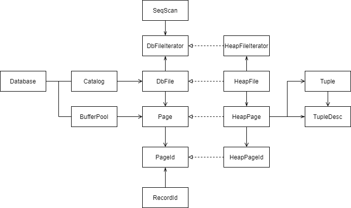

# Lab1 基本组件与位图管理

Lab1 实现数据库存储引擎的基本组件。

关键：位图实现元组管理系统。

**知识点：**

实现页式存储。

实现元组管理系统。

- 通过元组大小，计算页面所能容纳元组数。
- 通过元组数，初始化页头与存储元组的数组。

通过位图高效利用磁盘空间。

- （见文档最后的优点）

## 存储引擎基本组件

### 关系图



### 例

```sql
CREATE TABLE students (
    student_id INT,
    name VARCHAR(100),
    age INT
);
```

`students` 表相当于 HeapFile。

`student_id`、`name`、`age` 组成的一列数据相当于元组。

`student_id` 相当于元组中的个字段。

### 页式存储

页是数据库存储数据的最小单位。

SimpleDB 中单页大小 4KB。

一个表可能有多个页，数据存储在页中，以页为单位存储在磁盘中。

当访问表中数据时，可根据数据的页 ID 定位所在页，并将其从磁盘加载到内存中，性能高。

### 组件的文字描述

**DataBase**

DataBase 相当于整个数据库系统的中心枢纽，管理数据库中的所有组件，协调数据库的各个子系统。

- 管理 BufferPool
- 管理 Catalog
- 事务管理和锁管理，确保数据的一致性和隔离性（未学）

**Catalog**

Catalog 负责管理数据库中的所有表和索引，其维护了每个表的引用。

执行查询操作时，Catalog 提供表结构（文件引用、表名称、主键）供查询处理器使用。

将一个表的三个属性封装为内部类，通过一个 Map 维护目录。

**BufferPool**

BufferPool 缓冲池，缓存 Page 至内存中。

**HeapFile**

HeapFile 是对硬盘 HeapFile 操作的抽象，一个 HeapFile 对应一个物理文件。SimpleDB 会将多个 HeapPage 连续写入文件。

- File：实际物理文件
- TupleDesc：该表的 Tuple 元数据

**HeapPage**

数据库的基本存储单元

- HeapPageId

- byte[] header：槽位状态位图，用来表示每个槽位的使用状态，以 bit 为单位。

- int numSlots：槽位数，也是页面最多所能放元组的个数

- TupleDesc

- Tuple[] tuples

**HeapPageId**

- int tableId：所在表的编号
- int pageNumberOnTable：该页在该表上的索引

**Tuple**

- TupleDesc
- RecordId
- ArrayList<Field> fields

**TupleDesc**

TupleDesc 是 Tuple 的元数据，描述了 Tuple 每个 Field 的类型和名称。

<span style=color:blue;>每个表的所有 Page、所有 Tuple 都是相同的。在实际的数据库系统中，HeapFile 的所有 HeapPage 共享同一个 TupleDesc（通过 Catalog 根据 tableid 获取）。但每个 Page 仍然需要持有这个描述符以便独立完成数据的解析和验证（如校验当前页中元组的数目）。</span>

- ArrayList<TDItem> tdItems
- TDItem
    - fieldType
    - fieldName

**RecordId**

RecordId 是元组的唯一标识符

- PageId：所在页面编号
- int tupleNumberOnPage：该元组在该页面上的索引

## 位图&元组管理系统

### 页的初始化

**header 初始化**

根据元组大小，计算页所能容纳的元组数。

计算公式：$页可容纳的元组数 = \frac{页的 bit 数}{元组 bit 数+1} = \frac{4096 \cdot 8}{元组字节数 \cdot 8 + 1}$

- 结果向下取整，`+1` 是元组对应槽位的 bit。

```java
private int getNumTuples() {
    return (int) Math.floor((BufferPool.getPageSize() * 8.0) / (td.getSize() * 8 + 1));
}
```

计算 header 数组大小。

计算公式：$\frac{元组数}{8}$，结果向上取整。

```java
private int getHeaderSize() {
    return (int) Math.ceil(getNumTuples() * 1.0 / 8);
}
```

**元组初始化**

```java
Tuple[] tuples = new Tuple[numSlots];
```

**填充数据**

随后使用 I/O 流，读取传入的字节数据。

根据槽位与元组大小，截取对应字节数组。

然后将字节数组反序列化为 Tuple 对象。

### 槽位处理方法

```java
// 检查槽位为 0 还是 1
// i 为槽位索引
public boolean isSlotUsed(int i) {
    // 字节索引：i / 8
    int byteIndex = i / 8;
    // 槽位在该字节中的索引：i % 8
    int bitIndex = i % 8;
    // 取出 header 中对应的字节
    int headerByte = header[byteIndex];
    // 通过位操作，检查字节中的对应槽位是否为 1
    return ((headerByte >> bitIndex) & 1) == 1;
}
```

```java
// 填充对应索引的槽位
// i 为槽位索引，value 为 0 或 1
private void markSlotUsed(int i, boolean value) {
    int byteIndex = i / 8;
    int bitIndex = i % 8;
    byte b = header[byteIndex];
    if (value) {
        // 设置位为1
        b |= (1 << bitIndex);
    } else {
        // 设置位为0
        b &= ~(1 << bitIndex);
    }
    header[byteIndex] = b;
}
```

### 优点

**页式存储中位图管理元组实例的优点**

- 空间换时间：向表中新增元组时，遍历 header 中的位，即可定位到页的空闲空间（类似索引）。
- 空间效率：位图将空间利用到了极致。
- 删除优化：删除元组只需改变位图对应 bit，无需立即擦除数据。