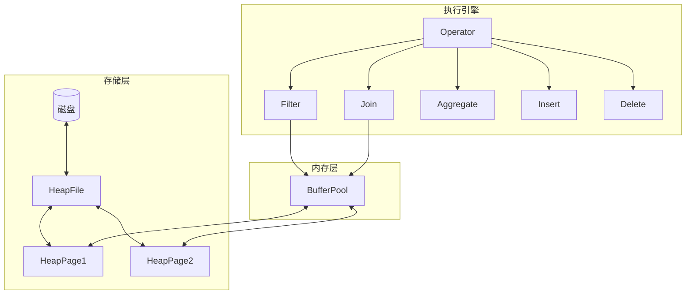
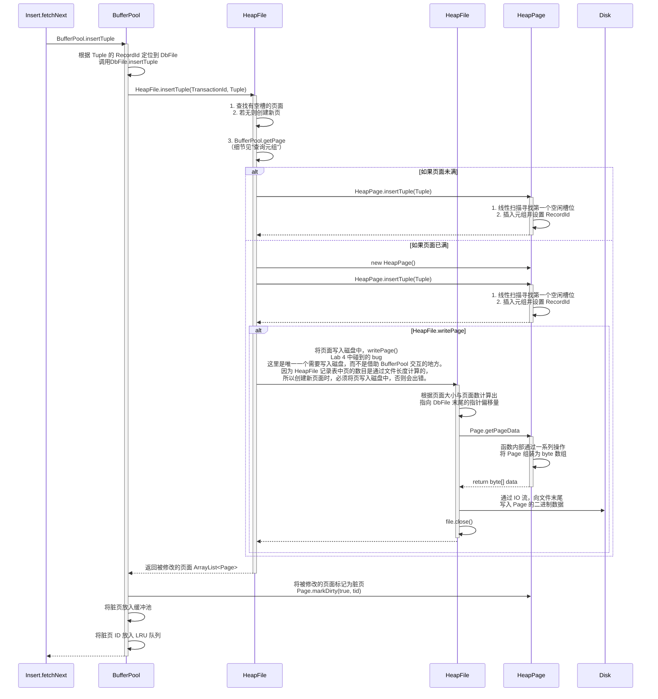
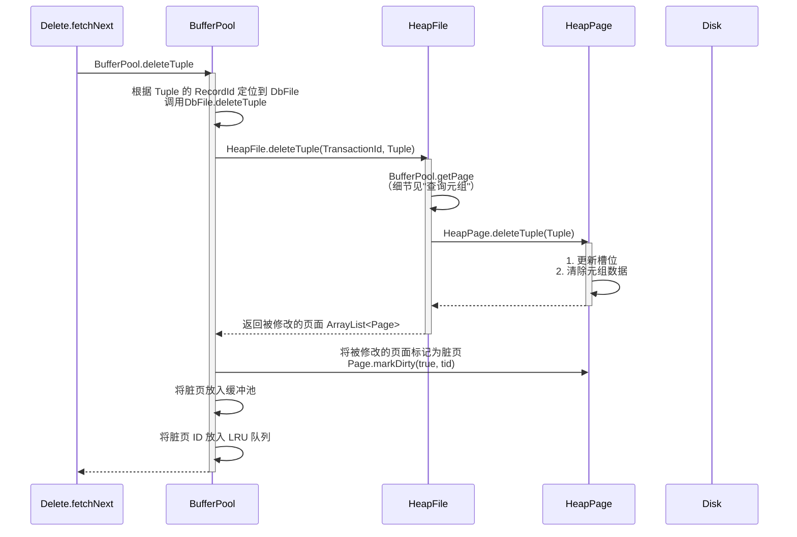
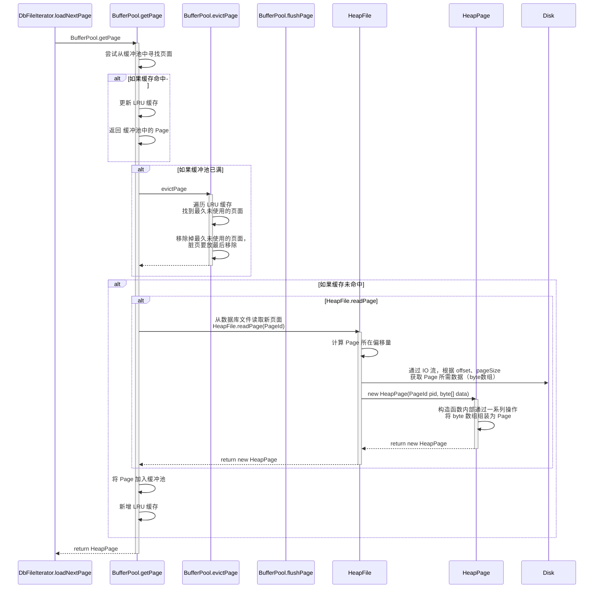
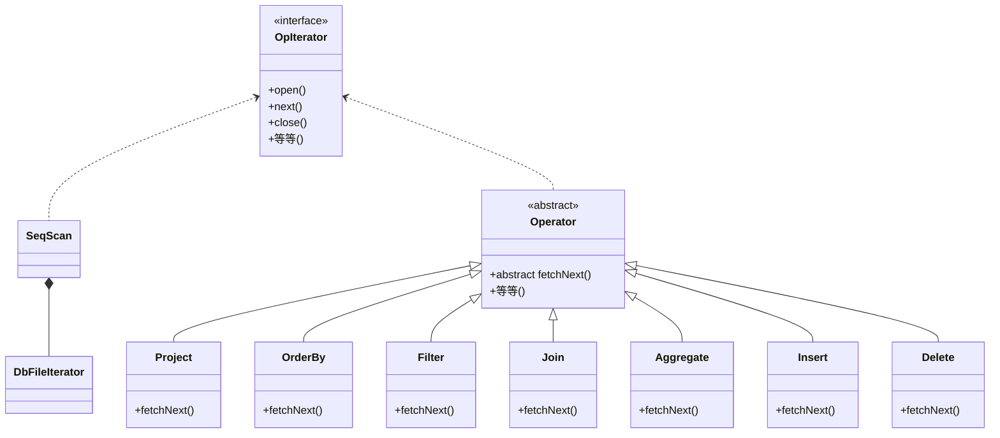
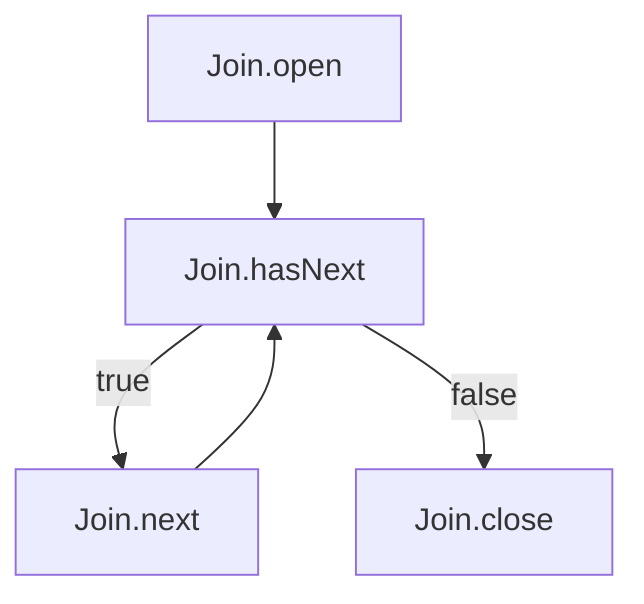
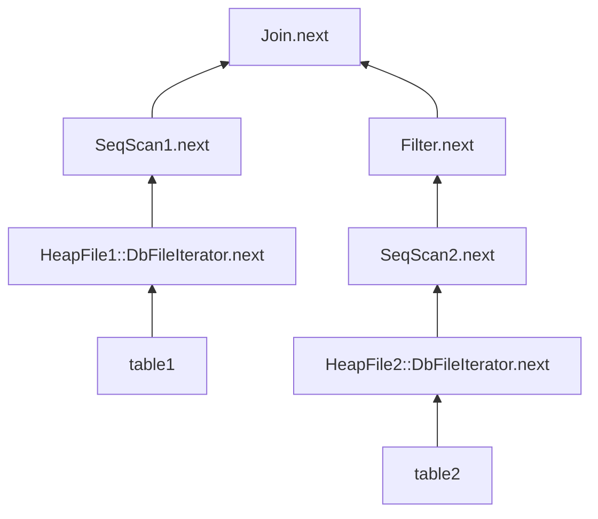
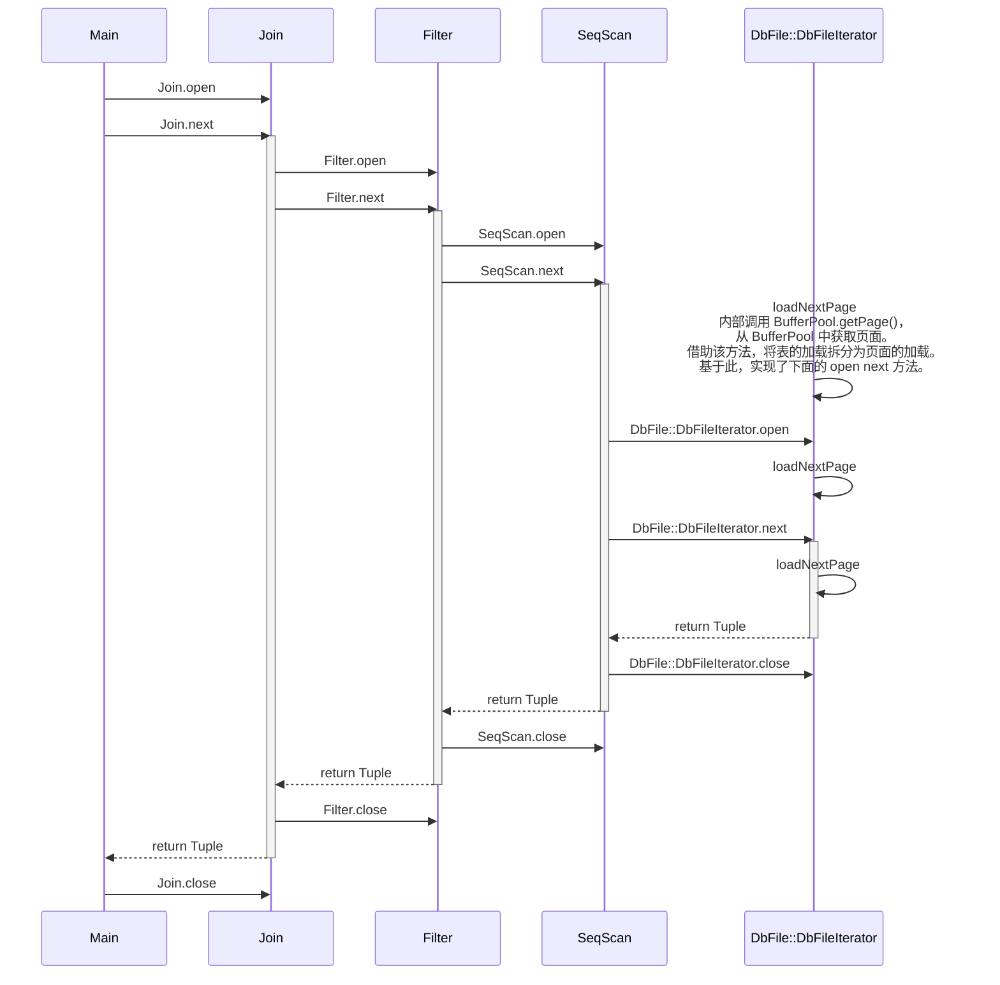

# Lab2 火山模型与LRU-K

Lab2 实验目标：

- 实现数据库存储引擎关键模块（BufferPool/HeapFile/HeapPage）。
- 基于存储引擎，实现基本的 DML 操作（增/删/查，从操作符到磁盘）。
- 基于火山模型，利用模板方法模式，实现操作符，构建基本的执行引擎。

参考链接

[MIT-6.830 Lab2 总结与备忘 thomas-li-sjtu.github.io](https://thomas-li-sjtu.github.io/2022/06/17/Simple-DB-Lab2/)

[LRU-K和2Q缓存算法介绍](https://github.com/lidaohang/ceph_study/blob/master/LRU-K%E5%92%8C2Q%E7%BC%93%E5%AD%98%E7%AE%97%E6%B3%95%E4%BB%8B%E7%BB%8D.md)

[经典论文解读——Cache 替换算法](https://zhuanlan.zhihu.com/p/591436083)（讲了各种缓存替换算法，拓展眼界。）

关键：

- BufferPool LRU 页面淘汰策略、脏页管理。
- HeapPage 页式存储结构，通过位图管理页中元组。
- 模板方法模式、火山模型。

其他：

- SimpleDB 中主要实现 DML（数据库操作语言）的增删查，并没有实现 DDL（数据库设计语言）。
- 代码框架已经提供了大部分 I/O 操作的具体实现。



## 基本存储引擎

BufferPool

- LRU 页面淘汰策略（`getPage`/`evictPage`）
- 脏页管理（`flushPage`/`markDirty`）

HeapFile&HeapPage

- 磁盘与业务逻辑交互的关键。
- HeapFile 是磁盘交互的管理者，HeapPage 是数据页面的内存表示。
- I/O 的关键就在于此，HeapPage 相当于一个用来让业务逻辑与磁盘交互的中间态。
- 例如 insertTuple，将 Tuple 所在页面从磁盘反序列化为内存中的 HeapPage，实现 insertTuple 逻辑后，再将修改后的 HeapPage 序列化进磁盘，完成数据页的修改。
- 课程框架已经实现了 SimpleDB 中的大部分 I/O 操作。（看来课程设计者认为 I/O 不是重点。）

关键方法（细节在"DML实现"的时序图中）

- BufferPool.getPage
- BufferPool.insertTuple&deleteTuple
- HeapFile.readPage&writePage

## DML实现

增：`Insert.fetchNext` -> `ButterPool.insertTuple` -> `HeapFile.insertTuple` -> `HeapPage.insertTuple` -> `HeapFile.writePage`

删：`Delete.fetchNext` -> `ButterPool.deleteTuple` -> `HeapFile.deleteTuple` -> `HeapPage.deleteTuple` -> （不需要写入磁盘，只需去除 header 标记即可，后续 Insert 会覆盖磁盘数据）

改：先 Delete 后 Insert。

查：`SeqScan.next` -> `HeapFile.iterator` -> `DbFileIterator.next` -> `DbFileIterator.loadNextPage` -> `BufferPool.getPage` -> `HeapFile.readPage` -> `new HeapPage`

### Insert



### Delete



### Select

实现 LRU 页面淘汰策略。

重写了 `getPage`，实现了 `evictPage`、`flushPage`、`flushAllPage`、`discardPage`。

- flushPage 刷新磁盘
- discardPage 只移除页面，不刷新磁盘（丢弃修改）

其中，前三个是实现 LRU 会用到的；`discardPage` 后面的实验会用到；`flushAllPage` 测试接口，无用。



## 操作符实现

### 模板方法模式

**UML 类图**



对于除 SeqScan 外的操作符，体现了模板方法模式。

Operator 借助抽象方法 fetchNext，统一实现了 open next close 等各个操作符通用方法的内部逻辑。

需要操作符各自实现的不同逻辑，抽象为方法 fetchNext。各个操作符继承 Operator，实现各自的 fetchNext。

**SimpleDB 中的特殊存在**

操作符中 SeqScan 相当于 Select，是个特例，直接实现自 OpIterator 接口。

SeqScan 相当于火山模型中最原始的孩子结点，再往底层深入，就涉及到了 DbFile、DbFileIterator、BufferPool 从 HeapFile 中获取具体元组数据的逻辑。

### Filter&Join

**复习SQL**

Filter：

```sql
SELECT *
FROM Employees
WHERE Department = '销售部';
```

Join：

```sql
SELECT * 
FROM Employees
JOIN Departments
    ON Employees.DepartmentID = Departments.ID;
```

**涉及到的类**

> `Predicate.Op`

内部枚举类：定义了各个比较操作符，以及操作符与可视化 SQL 字段间的映射（如 `=` 与 `EQUALS`）。

> `Predicate` `JoinPredicate`

相当于流水线的质检标准，即评判是否符合条件的标准。

Filter：

```sql
SELECT *
FROM Employees -- child
WHERE Department = '销售部'; -- Predicate条件
```

Join：

```sql
SELECT * 
FROM Employees -- 左表child1
JOIN Departments -- 右表child2
    ON Employees.DepartmentID = Departments.ID; -- JoinPredicate条件
```

> `IntField` `StringField`

字段类，关键是 `Field.compare(Predicate.Op, Field)` 方法，识别可视化 SQL 字段，根据类型的不同进行各自的比较。

> `Filter` `Join`

操作符类，关键是实现 `fetchNext` 方法，顺利融入火山模型。

**代码细节**

Predicate.java 重点

- Op 内部类：将 SQL 以字符串形式存储

- 谓词三要素，构成过滤条件的基本元素

    ```sql
    SELECT * FROM students 
    WHERE age > 18 
      AND major = 'Computer Science'
    ```

    ```java
    // 要比较的字段位置（如 age 是表中的第x个字段）
    private final int field;
    // 比较类型（>||=）
    private final Op op;
    // 比较值（如 18 'Computer Science'）
    private final Field operand;
    ```

- 核心过滤方法，执行数据筛选

    ```java
    public boolean filter(Tuple t) {
        // 通过 field 获取要比较的具体字段值
        Field fieldValue = t.getField(field);
        // 调用比较方法（IntField.compare(Predicate.Op, Field) 与 StringField.compare(Predicate.Op, Field)）
        return fieldValue.compare(op, operand);
    }
    ```

### Aggregate

**复习SQL**

```
| 部门(STRING) | 销售额(INT) |
|------------|-----------|
| 市场部      | 5000      |
| 技术部      | 8000      |
| 市场部      | 6000      |
| 技术部      | 9000      |
```

```sql
SELECT 部门, MAX(销售额)
FROM 表名
GROUP BY 部门;
```

```
|  部门      | MAX(销售额) |
|------------|-----------|
| 市场部      | 5000      |
| 技术部      | 8000      |
```

```java
IntegerAggregator agg = new IntegerAggregator(
    0,          // 按第 0 列（部门）分组
    Type.STRING_TYPE, // 第 0 列是 String 类型 
    1,          // 聚合第 1 列（销售额）
    Op.MAX      // 计算最大值
);
```

咕咕咕（其余操作符具体实现的笔记不做了，个人认为那些细节并不是很关键）

## 火山模型

### 介绍

**特点（重点）**

- 迭代器模式，实现流水线式处理。
- 惰性求值，高效利用内存。

**为什么叫火山模型？**

结合其特点：

数据犹如岩浆。火山**上窄下宽**，底部堆积着大量数据，经过火山**层层筛选与处理**（流水线式处理），处理后的数据**逐渐**（惰性求值）从顶层流出。

**优点**

- 灵活：操作符的组合，调用者便于使用，开发者便于拓展。
- 内存高效：流水线式处理，不必保存中间结果，高效利用内存。惰性求值，同样高效利用内存。

**缺点**

- 性能开销大：频繁在上下游间调用方法。

**其他实现方式**

向量化。

### 实现

SimpleDB 中的实现。以 Lab2 2.6 jointest为例。

**解析器起始**

对于执行链最顶层的操作符，解析器会利用迭代器模式循环调用 `next` 方法。



**概览**

数据自底向上，被筛选处理。



**时序图**

偏细节。



**文字描述**

> 存数据

jointest 中，手动存入数据，将数据文件与数据库关联起来。

硬盘上已经存在 file.dat 文件。

将其初始化为 HeapFile，然后将 HeapFile 加入 DataBase 存储 DbFile 的 Map 中。

自此数据库中多了两张可以使用的表。

> 火山底

SeqScan 本身就是最原始的孩子节点，最初的 `next` 通过一系列流程从缓冲池中获取原始数据。

获取原始数据流程：

`SeqScan.next` -> `HeapFile.iterator` -> `DbFileIterator.next` -> `DbFileIterator.loadNextPage` -> `BufferPool.getPage`

> 火山中部流水线

Filter 就有了孩子节点的概念，需要从 `child.next` 返回的数据中，筛选或处理出满足要求的节点。

Filter 是一个孩子节点的父节点，也是另一个父节点的孩子节点。

> 火山口

最顶层操作符 Join 循环打印 Join.next 返回的 Tuple 元组。

## 其他

看懂 2.6 中 jointest 类的代码，基本就能理解 SQL 操作符组合的实现原理，即火山模型。

**脏页**

脏页是指内存中的数据页已经被修改过，但还没有将修改写回磁盘。

现在看来，很多东西是互通的，比如数据库、操作系统、JVM 中都有类似脏页的概念。

**小bug**

自己用的 java 21 与 ant 1.10.15 有兼容性问题，导致 ant 无法编译通过 Java 14 支持的新语法，改回旧语法即可。

```java
// Java 14 新语法
if (o instanceof PageId pi) {
}
```

```java
// Java 8 兼容的旧语法
if (o instanceof PageId) {
    PageId pi = (PageId) o;
}
```

半天没检索出来是因为自己忽视了 ant 的报错。命令行上运行 java 程序，需要先使用 ant/maven 等编译工具，将 java 代码编译为可执行文件。IDEA 用多后，自己忽视了最基本的东西。
