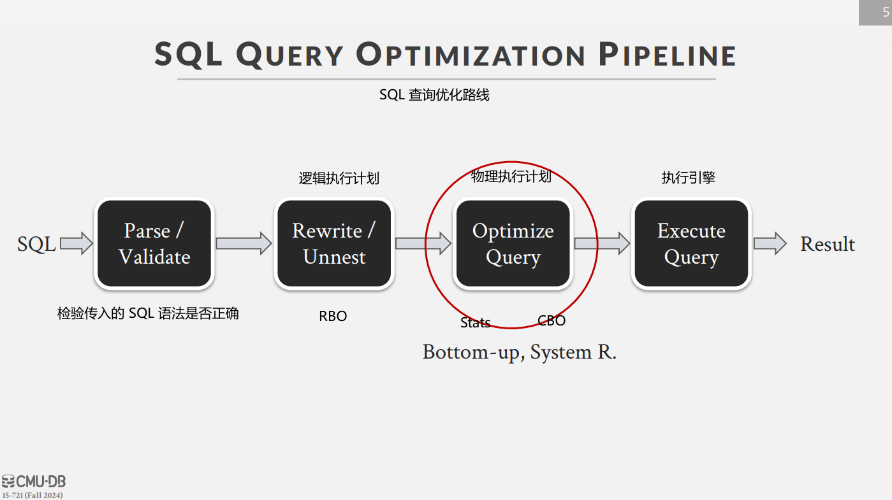
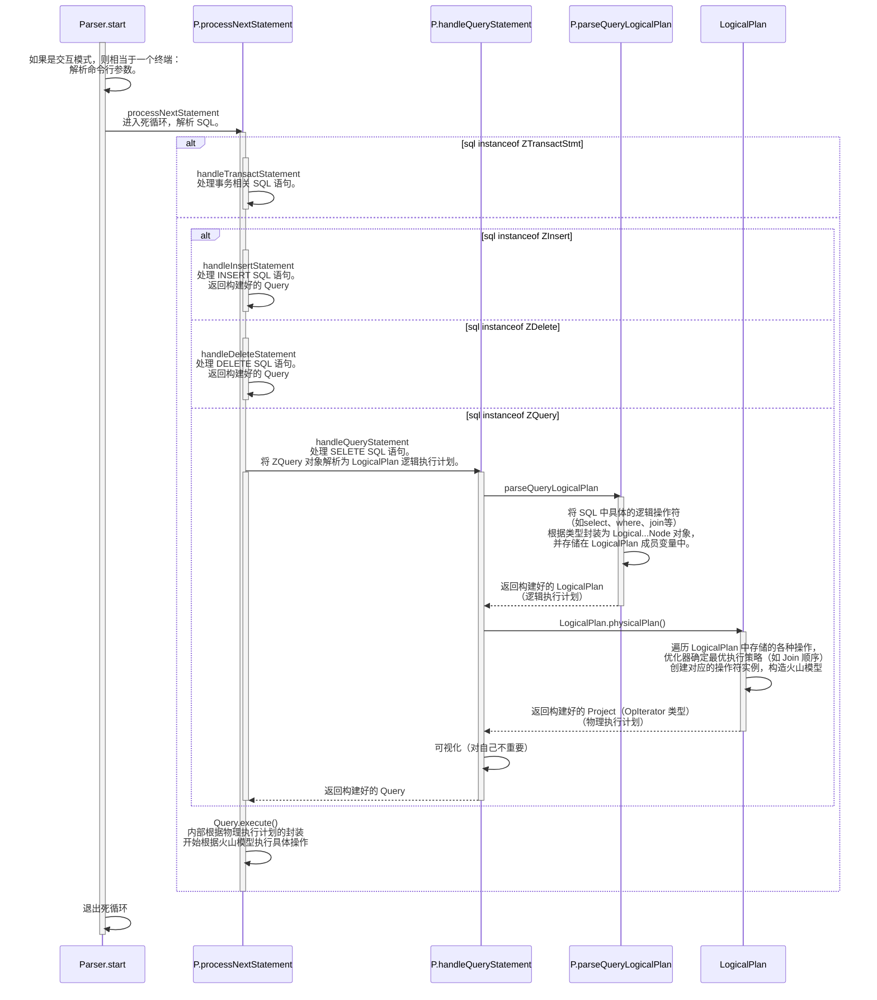
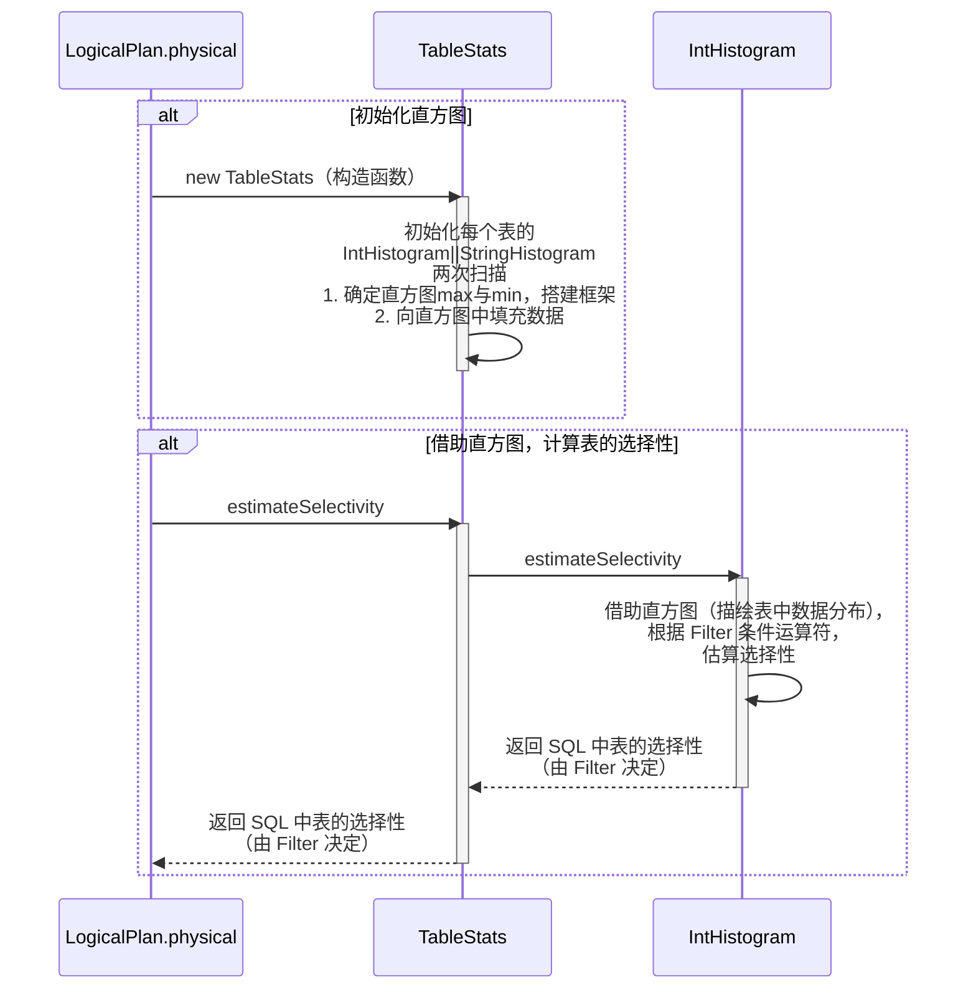
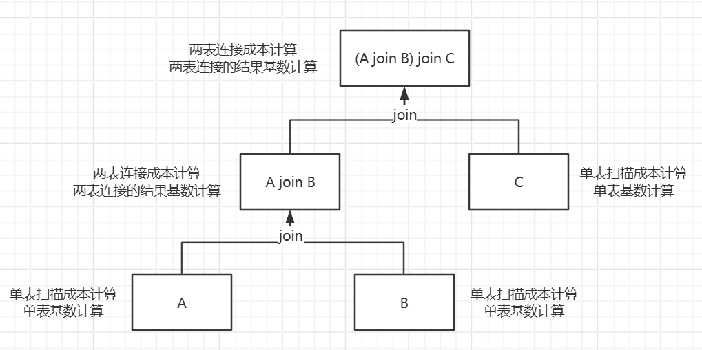
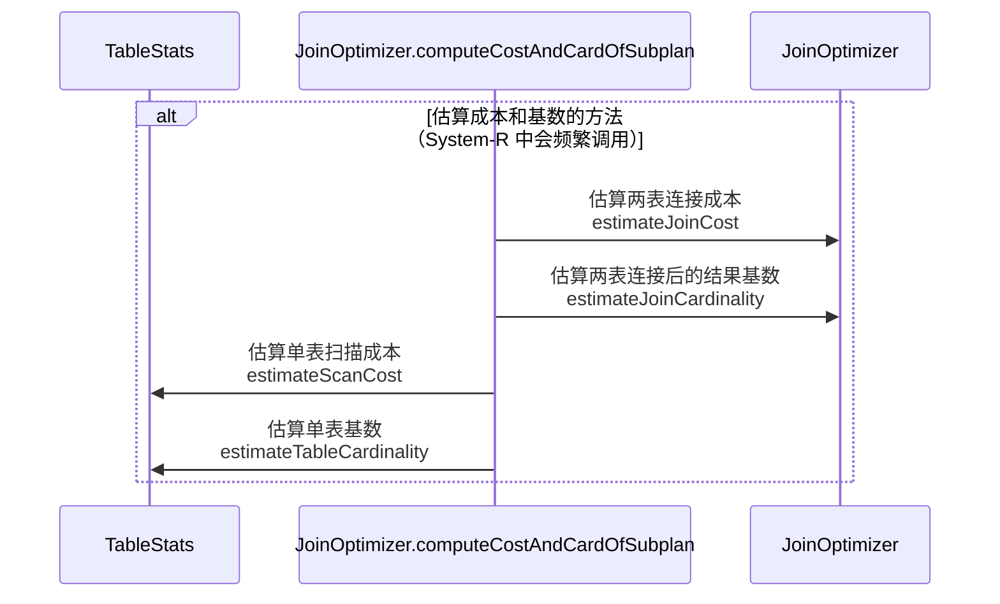
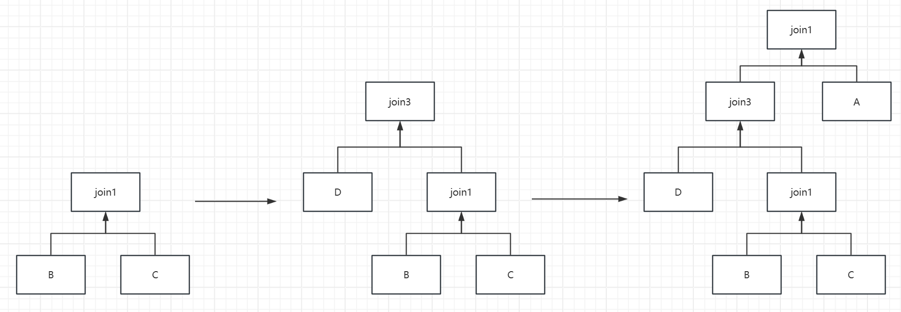
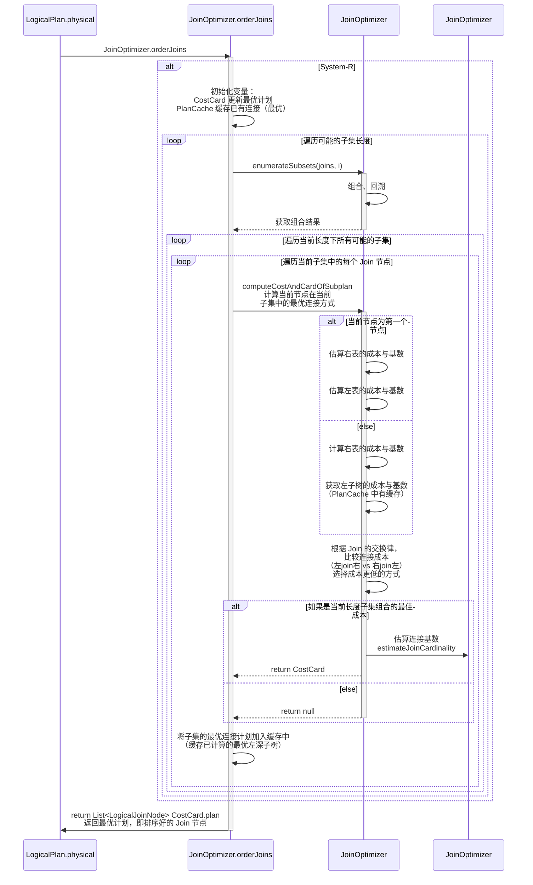
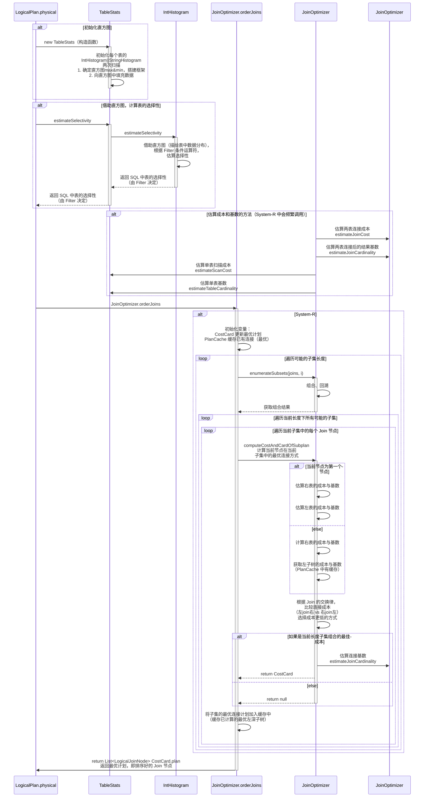

# Lab3 Join成本估算与System-R优化器

Lab 3 是对选择性估计框架和 System R 优化器的简单实现。

参考链接

[MIT6.830-2022-lab3实验思路详细讲解 csdn.net](https://blog.csdn.net/weixin_45938441/article/details/128447702)

[TiDB 源码阅读系列文章（七）基于规则的优化](https://cn.pingcap.com/blog/tidb-source-code-reading-7/)

[TiDB 源码阅读系列文章（八）基于代价的优化](https://cn.pingcap.com/blog/tidb-source-code-reading-7/)

[cmu15721 f24 lecture2 Selinger-SystemR-opt slide](https://www.cs.cmu.edu/~15721-f24/slides/02-Selinger-SystemR-opt.pdf)

[cmu15721 f24 lecture2 Selinger-SystemR-opt note](https://www.cs.cmu.edu/~15721-f24/notes/02_QO1.pdf)

## 介绍

### 优化器

早期优化器是程序员的工作，需要自行制定物理执行计划。

现代数据库管理系统（DBMS）是声明式使用方式，程序员只需说明要检索什么数据，由 DBMS 优化器来实现具体如何检索。

### System-R

System R 数据库管理系统，主要是 IBM 为了研究目的而创建的。它在创建查询规划器和优化查询计划方面发挥了关键作用，是同类中的第一个。

[Access Path Selection in a Relational Database Management System](https://courses.cs.duke.edu/compsci516/cps216/spring03/papers/selinger-etal-1979.pdf)

优化器框架方面的经典论文，提出的制定 SQL 查询计划思想（自下而上+启发式+基于代价评估）开创先河，至今仍被很多主流数据库所沿用。

- 自下而上：优化器评估所有可能的访问路径，从最基本的操作开始，自下而上逐步构建出总成本最低的方法。
    - 例如 System R 对多表连接的优化，从选择最优的两表连接开始，逐步构建出最优连接。
    - 优点：全局最优。
    - 缺点：计算量大。
    - 与之对应的自上而下方法：从查询的目标结果开始，逐步推导出执行计划。最终的计划局部最优而非全局最优，但是计算量小。
- **启发式**：指的是一种**基于<span style="color: red;">经验</span>或<span style="color: red;">简化</span>的规则**，用来估算某个问题的解决方案，而不一定是通过精确的计算或算法来得出结果。在数据库查询优化中，启发式方法常常用于**估算查询操作的成本**或者**结果集的大小**。
- 基于代价评估：CBO。

### 优化器的实现

主要有两种：

- 基于规则的优化器（Rule Based Optimizer，RBO）

    - 基于一些预定义的启发式规则选择执行计划。并不需要计算每种查询计划的代价，而是根据启发式规则的优先级来选择。

    - 例如：

        - **连接时选择小表作为外层循环**。Join 连接方式为嵌套循环连接（Nested Loop Join）。

            理由：

            - deepseek 给出小表驱动的关键理由是防御性优化设计。常见场景下，大表远大于小表。大表外层循环相当于高频小量 IO，小表外层循环相当于低频大量 IO。高频小量会导致触发缓存抖动和页替换雪崩的概率增加，为了稳定，选择小表驱动。
            - 还有一种说法是，当大表与小表连接时，大表通常有索引，例如员工表与部门表。大表在内层连接，每次连接时通过索引访问，不必全表扫描，效率更高。
            - （还是很糊涂，Join 连接优化有很多说法的，除了嵌套循环连接，还有索引嵌套循环连接、缓存块嵌套循环连接、Hash Join 等。自己没必要再深入了，记住这个启发式规则就好。）

        - **条件下推**：将过滤条件下推到表扫描阶段，减少后续操作（如 Join）所需处理的数据。

    - 简单，计算量小。但不是最优解。

- 基于成本的优化器（Cost Based Optimizer，CBO）

    - 通过计算每种可能的执行计划的代价（I/O 成本、CPU 成本、内存使用等），选择成本最低计划。
    - 最优解。但是计算量大。

Lab3 主要实现的是 CBO。

### 文章脉络

- 了解 SQL 解析流程。
    - 了解 System-R 优化器在解析流程中处于什么样的位置，被谁调用。
- 现代基数估计方法。
    - 通过为字段构建直方图，估算条件查询对表的选择性，从而估算出表的基数。
- 成本估计。
    - System R 优化器需要比较不同连接计划的成本，因此该部分实现四个方法，计算单表的扫描成本与基数，计算两表连接的成本与结构基数。
- System-R 优化器实现。
    - 结合动态规划思想与左深树结构，优化计算效率。

## SQL解析流程

### 简单流程

一个查询语句的简单流程：一个语句经过 Parser （SimpleDB 中通过 Zql 库解析）后会得到一个抽象语法树（AST），首先用经过**合法性检查**后的 AST 生成一个逻辑计划，接着会进行去关联化、谓词下推、聚合下推等**规则化优化**（RBO），然后通过**统计数据**计算**代价**（CBO）选择最优的物理计划，最后执行。



### LogicalPlan&PhysicalPlan

理解解析器的重点：逻辑执行计划和物理执行计划。

- 逻辑执行计划
    - `Parser.parseQueryLogicalPlan`
    - 关注“做什么”，而不是“怎么做”。
    - **将 SQL 解析为逻辑操作序列**（如扫描表、过滤条件、连接、聚合等），但不涉及具体执行细节（如算法选择或物理资源分配）。将解析后的操作序列封装进 `LogicalPlan` 的成员变量中。

- 物理执行计划
    - `LogicalPlan.physicalPlan`
    - 关注“怎么做”，是逻辑执行计划的具体执行细节。
    - 根据逻辑执行计划（`Logical` 中封装操作序列的成员变量）**将 SQL 逐层封装为物理操作符**，通过**优化器确定最优执行策略**（如 `Join` 顺序，索引选择），构建火山模型。

- 最后返回封装的 `Query` 对象，通过 `next` 方法调用火山模型，完成 SQL 的执行。

### SimpleDB中的流程

SimpleDB 中一条 SQL 执行的简要流程如下：



文字描述：

`start(String[] argv)`

`processNextStatement(InputStream is)`：解析一条 SQL。通过 Zql 库解析 SQL，判断 SQL 类型（查、增、删），随后调用对应语句的专用处理方法，将其解析为 `LogicalPlan`，返回给 `Query` 实例，通过 `Query.execute` 调用火山模型执行。

- `handleTransactStatement(ZTransactStmt s)`：处理事务相关 SQL 语句。
- `handleInsertStatement(ZInsert s, TransactionId tId)`：处理 `INSERT` SQL 语句。
- `handleDeleteStatement(ZDelete s, TransactionId tid)`：处理 `DELETE` SQL 语句。
- `handleQueryStatement(ZQuery s, TransactionId tId)`：处理 `SELECT` 查询语句。
    - `parseQueryLogicalPlan(TransactionId tid, ZQuery q)`：将 `ZQuery` 对象解析为 `LogicalPlan` 逻辑执行计划。（解析这条 SQL 语句，将里面的逻辑提取成 `Logical...Node` 对象存储到 `LogicalPlan` 成员变量中。）
        - `processExpression(TransactionId tid, ZExpression wx, LogicalPlan lp)`：处理 `WHERE` 子句中的过滤条件。
    - 调用 **`LogicalPlan.physicalPlan`**，生成物理执行计划（具体的执行步骤），如确定扫描表的顺序，是否使用索引等。
    - 返回 `query`。

`shutdown()`

其中，LogicalPlan 表示解析后的逻辑查询计划。

- LogicalPlan 中 SQL 语句被分解为多个组件。
    - LogicalScanNode
    - LogicalFilterNode
    - LogicalJoinNode
    - LogicalSelectListNode
    - Aggregate 和 OrderBy 属于后处理操作，不需要调整顺序或结构，仅需记录元信息。因此不需要独立节点表示。
- 主要方法：
    - physicalPlan 将逻辑计划转换为物理计划，内部使用 JoinOptimizer 优化连接顺序。

## 现代基数估计方法-直方图

实现 System-R 需要计算每个连接间的成本，计算 I/O CPU 成本需要知道表的基数。

扫描整个表是资源密集型的。因此，取而代之的是收集数据的样本，并基于样本构建直方图。

### 初始化直方图

**文字描述**

TableStats 构造函数中：

首先遍历一遍表中元组字段的每一个实例，找出最大值最小值。

根据最大值与最小值计算出直方图桶的宽度，初始化直方图。

再次遍历字段实例，根据字段的值，将对应桶的计数 + 1。

**举例**

假设有 2000 随机数存储在表中，随机数 ∈ [1, 500]。

桶数默认为 100，第一次遍历，找到随机数最大值为 500，最小值为 1。

根据这些参数创建直方图。

再次遍历随机数，随机数的值属于哪个桶的范围，该桶计数 + 1。

比如遍历到了 3，3 属于第一个桶（1 ~ 5），bucket[0]++。

### 估计选择性

**文字描述**

`TableStats.estimateSelectivity` 中，根据字段在元组中的索引，找到该字段的直方图，调用方法。

`IntHistogram.estimateSelectivity` 中，通过运算符与比较值两个参数，根据直方图，计算选择性。

- 判断运算符种类，进入对应逻辑。
- 计算比较值所在桶的索引。
- 计算所有小于比较值的桶的总计数。
- 计算比较值所在桶的部分贡献。
- 返回比例，即该谓词的选择性。

**举例**

以上一个示例的数据为准。2000 个随机数，值 ∈ [1, 500]。

`select * from table where value < 204`

找到字段 value 的直方图。运算符 `<`，比较值 204。

方法内：

- 判断运算符为 `<`，进入 `<` 的逻辑。
- 204 所在桶的索引为 $(int) (204 - 1)/5 = 40$。
- 在 204 之前有 40 个桶，累计前 40 桶里的字段个数。
- 204 所在桶的值的范围为 [201, 205]，204 处于 $\frac{3}{5}$ 的位置。
- $谓词选择性 = \frac{\sum_{i=0}^{39} bucket[i] + bucket[40] \times \frac{3}{5}}{字段总数}$

其中，$bucket[40] \times \frac{3}{5}$ 属于估计值。

### 时序图



### 其他

**重磅值问题**

等宽直方图的缺陷：

实际场景中，数据中会出现重磅值（heavy hitters），即某个范围内的值占据了数据的多数。

重磅值会扭曲数据分布，使选择性估计的误差变大。

解决方案：

等深直方图 + 最常见值模型。

单独存储重量级数据。

**初始化直方图问题**

问题：

SimpleDB 中，初始化直方图会遍历表中的每一个字段。

以现代 DBMS 的数据量，逐个遍历显然不切实际。

解决方案：

随机采样直方图箱数的 300 倍。

**如何更新直方图？**

后台定时重新统计数据，更新直方图。

**其他估算基数的方法**

草图。

## 成本估算

### 基本概念

- 表基数（Table Cardinality）
    - 表的总行数。
- 表选择性（Table Selecivity）
    - **所有**查询条件应用后，被选中的行占总行数的比例。
    - 例如：表的所有查询条件 `WHERE age > 20 and dept_id = 3`，从 10,000 条记录中选出 2,000 条，则选择性为 0.2。
- 谓词选择性（Predicate Selectivity）
    - **单个**查询条件应用后，被选中的行占总行数的比例。
    - 例如：单个谓词的查询条件 `WHERE age > 20`，从 10,000 条记录中选出 7,000 条，则选择性为 0.7。
- 字段基数（Column Cardinality）
    - 字段中不同值的数量。
    - 例如：性别字段基数为 2。
- 字段选择性（Column Selectivity/Selectivity Factor）
    - 字段唯一值的程度。
    - 例如：性别字段有 1,000 个实例，则字段选择性为 0.002。
    - 计算方式：字段基数 / 字段总记录数。
    - 作用：
        - 等值查询：谓词选择性 ≈ 1 / 字段基数（假设值均匀分布）。
        - 索引：在索引设计中很重要，高选择性的字段更适合建立索引。

SimpleDB 中，主要用到的是表基数、表选择性和谓词选择性。

### 成本估算概述

System R 是基于成本的优化器，需要从所有可能的路径中比较成本，选择成本最低的连接。

相关计算的关系如下图：



成本计算公式：$成本 = 常数缩放因子 \times  I/O 成本 + CPU 成本$

- 常数缩放因子：SimpleDB 中为了使 I/O 成本与 CPU 成本可比较，假设 I/O 成本为 CPU 成本的 1000 倍。

计算 I/O 成本与 CPU 成本需要知道表基数。

表基数计算公式：$表基数 \approx 表选择性 \times 元组数$

表选择性通过直方图估算。

### 计算公式详解

**单表扫描成本**

```java
scancost =
numPages * ioCostPerPage // IO cost
// 页数 * 单页 IO 成本（常数缩放因子 * 1，1 是 CPU 成本）
```

**两表连接成本**

主要取决于 Join 操作符内部连接方法的具体实现，SimpleDB 中采用了最简单的嵌套循环连接。

```java
joincost(t1 join t2) =
scancost(t1) + ntups(t1) x scancost(t2) // IO cost
// 表1扫描成本 + 表1元组数 * 表2扫描成本
+ ntups(t1) x ntups(t2) // CPU cost
// 嵌套循环连接，比较次数为(表1元组数*表2元组数)，每比较一次，CPU 成本数 + 1。
```

**单表基数**

```java
tableCardinality =
(int) Math.round(numTuples * selectivityFactor)
// 表元组数 * 表选择性
```

**两表连接的结果基数**

- 等值连接
    - 涉及主键
        - 当其中一个属性是主键时，连接结果的基数不会超过主键所在表的基数。
        - 当两个属性都是主键时，选择相对更小的表的基数。
        - **原理**：主键是唯一的，等值连接时，结果不可能超过主键所在表的基数。
        - 例如：`select * from A join B on A.id = B.a_id;`，假设 A 有 5 个元组，B 有 8 个元组，这条 SQL 的查询结果不可能超过 5。
    - 无主键
        - 对于没有主键的等值连接，很难准确估计连接结果基数。按照经验法则，基数选择两表中的较大者。
- 非等值连接
    - 对于非等值连接，同样很难准确估计连接结果基数。按照经验法则，连接后新表的基数为 30% 的交叉乘积。

```java
// 计算两表连接的结果基数
int card = 1;
if (joinOp.equals(Predicate.Op.EQUALS)) { // 等值连接
    if (!t1pkey && !t2pkey) {
        card = Math.max(card1, card2);
    } else if (t1pkey && t2pkey) {
        card = Math.min(card1, card2);
    } else if (t1pkey) {
        card = card1;
    } else {
        card = card2;
    }
} else { // 非等值连接
    card = (int) (0.3 * card1 * card2);
}
return card <= 0 ? 1 : card;
```

### 时序图



## System-R优化器

### 前提

**前置知识**

- 在内连接中，多表 join 之间的顺序可以随意更换，而不影响最终结果。

**简化前提**

准确估计计划成本很棘手。实验中，做了如下简化：

- 忽略 BufferPool 缓存影响，假设对表的每次访问都会产生全表扫描的成本
- 不考虑内存成本（除了 I/O 与 CPU，内存也是一个重要指标）
- 访问方法只有一种表扫描（不关注其他访问方法，如索引）
- 仅考虑 Join（不关注其他操作符的成本，如 Aggregate）

**辅助类与方法**

- `CostCard`：辅助类，相当于最优子计划
    - double cost：最优子计划的成本
    - int card：最优子计划的基数
    - List<LogicalJoinNode> plan：最优子计划
- `PlanCache`：缓存之前计算过的计划，避免重复计算。
- `JoinOptimizer.enumerateSubsets`：获取大小为 i 的所有子集。相当于回溯算法解决组合问题。
- `JoinOptimizer.computeCostAndCardOfSubplan`：计算子计划的查询代价。
- `JoinOptimizer.printJoins`：将连接计划进行特定格式打印。

**被谁调用？**

 `LogicalPlan.physicalPlan`

### 核心思路

**暴力**

要实现对所有可能 Join 连接路径成本的估算，最易想到的就是全排列，计算出所有可能连接路径的成本，时间复杂度为 $O(n!)$。

**System R 优化器**

> 动态规划思想、左深树结构、回溯计算组合、缓存机制避免冗余计算，四者的结合。

首先，**动态规划**的核心思想是，将问题分解为多个子问题，逐步构建出查询的最优执行计划。

System R 优化器从最小的子查询开始，估算成本，计算出最小子查询中的最优计划，并将其**缓存**。

通过**回溯算法**计算出所有可能的子查询**组合**。

配合动态规划，**左深树结构**限制了搜索空间。

**为何使用左深树结构？**

- 其流水线特性，允许逐步生成结果，降低了中间结果对内存的占用。
- 天然适配 Join 连接这种基于行的处理方式。

依靠左深树结构，与上一层左深树中缓存的最优计划，动态规划只需考虑当前层的最优连接方式，从而逐层构建出子集最优连接计划。

逐层构建，将它们合并成更大的子查询，构建出最终的最优执行路径。

最终，通过动态规划思想与左深树结构，实现了对**子问题最优解的复用**，避免了重复计算，大幅提升计算效率。

**时间复杂度计算**

关键：由计算全排列，优化到了计算所有子集的组合。

假设原始数据总数为 $n$。公式：$C_{n}^{k} = \frac{n!}{k!(n-k)!}$

全排列：$A_{n}^{n}$

- 时间复杂度为 $O(n!)$

长为 $k$ 的子集的组合：$C_{n}^{k} \cdot k$

- 时间复杂度为 $O(C_{n}^{k} \cdot k)$
- 证明：回溯算法，递归深度为 $k$，共有 $C_{n}^{k}$ 条路径，所以共需计算 $C_{n}^{k} \cdot k$ 次。（跟实际还不一样，想不明白组合的时间复杂度。）

所有子集的组合：$\sum_{k=1}^{n} C_{n}^{k} \cdot k = n \cdot 2^{n-1}$

- 时间复杂度为 $O(n \cdot 2^{n-1})$

**简历话术**

实现了 Join 操作的成本估算框架。

实现简易版的 System R 优化器，通过动态规划思想与左深树结构，实现了对**子问题最优解的复用**，将寻找最优连接路径的时间复杂度由 $O(n!)$ 降至 $O(n \cdot 2^{n-1})$。

### 示例

结合示例讲解 System-R 优化器实现的核心代码。

假设：`A join1 B join2 C join3 D`

首先被 `enumerateSubsets` 方法通过回溯算法遍历出所有子集的组合。

组合如下：

- join1、join2、join3
- join1 join2、join1 join3、join2 join3
- join1 join2 join3

先遍历长度为 1 的子集，join1、join2、join3。

`computeCostAndCardOfSubplan` 方法（后面简称 C 方法）遍历节点，估算每个节点的成本，将最优 Join 节点存储缓存中。

- `A join1 B`、`B join1 A`、`B join2 C`、`C join2 B`、`C join3 D`、`D join3 C` 比较成本。
- 假设 `B join2 C` 的成本最小。

再遍历长度为 2 的子集，join1 join2、join1 join3、join2 join3。

C 方法中，检查子集是否含有 join2。如果没有，则跳过；如果有，则估算 join 节点与 join2 连接的成本，选择更小的一个。

- 从缓存中已知上一个最优子查询为 `B join2 C`。
- `(B join2 C) join1 A`、`A join1 (B join2 C)`、`(B join2 C) join3 D`、`D join3 (B join2 C)`  比较成本。
- 假设 `D join3 (B join2 C)` 成本最小。

最后遍历长度为 3 的子集，join1 join2 join3。

- 从缓存中已知上一个最优子查询为 `D join3 (B join2 C)`。
- `A join1 (D join3 (B join2 C))`、`(D join3 (B join2 C)) join1 A` 比较成本。
- 假设 `(D join3 (B join2 C)) join1 A` 成本最小。



最终构建出成本最小的 Join 连接。

**可能的疑问**

System R 采用的不是左深树结构吗？上图最终构建出的却只是一个普通的连接树。

答：

Join 连接中，A join B 与 B join A 的成本并不相同。

在 `computeCostAndCardOfSubplan` 方法的最后，会比较两种连接的成本，可能会通过**交换连接顺序**来优化连接的成本。

因此，左深树结构在 System R 优化器中，更像是每次优化的起点。优化过程会更加灵活，导致最终的结果可能不是一个严格的左深树，而是一个基于成本最优化的普通连接树。

### 时序图



## 其他

下面这张时序图是 Lab3 的汇总。

