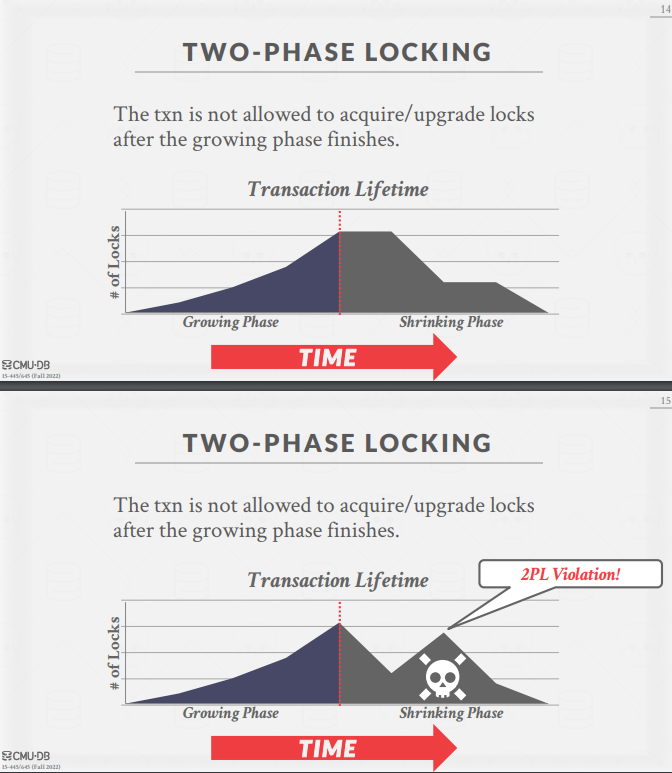
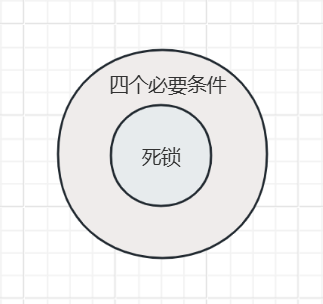

# Lab4 两阶段锁与死锁检测

Lab4 通过两阶段锁（2PL）实现串行化隔离级别。

参考链接

[MIT-6.830 Lab4 总结与备忘 thomas-li-sjtu.github.io](https://thomas-li-sjtu.github.io/2022/06/20/Simple-DB-Lab4/)

[cmu15445 f22 lecture16 two-phase-locking slide](https://15445.courses.cs.cmu.edu/fall2022/slides/16-twophaselocking.pdf)

[cmu15445 f22 lecture16 two-phase-locking note](https://15445.courses.cs.cmu.edu/fall2022/notes/16-twophaselocking.pdf)

相关知识：

- 什么是事务？四个特性？
- 并行事务存在的问题？
- 事务的隔离级别？
- 串行化？共享锁独占锁？两阶段锁协议？
- 死锁的解决方式？

`InnoDB` 引擎通过什么技术来保证事务的这四个特性的呢？

- 持久性是通过 redo log （重做日志）来保证的；（`flushPages`）
- 原子性是通过 undo log（回滚日志） 来保证的；（`restorePages`）
- 隔离性是通过 MVCC（多版本并发控制） 或锁机制来保证的；
- 一致性则是通过持久性+原子性+隔离性来保证；

## 锁管理器

锁的两种基本类型：

- 共享锁（读锁）：允许多个事务同时读取一个对象。如果一个事务持有共享锁，另一个事务也同样可以持有。
- 排他锁（写锁）：允许事务修改对象。一次只能有一个事务持有排他锁。

DBMS 包含一个集中的锁管理器，基于上面两种锁的特性，管理事务是否可以获取锁。

## 两阶段锁

### 介绍

两阶段锁（2PL）是一种并发控制协议，用于确定事务是否可以动态访问数据库中的对象。

两个阶段：

- 增长阶段：事务向锁管理器请求设置锁。
- 收缩阶段：事务在提交或回滚后，释放所有锁。

核心：如果一个事务释放了它所持有的任何一个锁，那该事务再也不能获取任何锁。

> Lab 里，LockManager 相当于事务并发的调度站，因此需要确保自身变量与方法的线程安全。后续代码逻辑的线程安全基于 LockManager 来保证。



### 实现

SimpleDB 中实现的是页级锁。事务在 `BufferPool.getPage` 中获取锁。

基于 Lab2 的实现，表的增删查都要经过 `BufferPool.getPage`，因此只需在该方法中设置 `setLock` 即可。执行增删查时传入参数，指定锁的类型。

- `HeapFile.iterator()`：共享锁，`READ_ONLY`。
- `HeapFile.insertTuple()` & `HeapFile.deleteTuple()`：排他锁，`READ_WRITE`。

事务：

- 提交：将事务相关的脏页刷新进磁盘。
- 回滚：恢复事务执行前的磁盘状态。

bug：`HeapFile.insertTuple` 中，当元组已满，新增页面时，需要将新增的页面立即写入磁盘，因为表页面数的计算基于磁盘文件的长度。SimpleDB 增删查中，目前唯一一处不经过 BufferPool，需要直接操作磁盘的逻辑。

## 死锁

### 介绍

[死锁 javaguide.cn](https://javaguide.cn/cs-basics/operating-system/operating-system-basic-questions-01.html#%E6%AD%BB%E9%94%81)

死锁的四个必要条件：互斥、占有并等待、非抢占、循环等待。

满足四个必要条件，并不一定会发生死锁。



解决死锁的方法：

- 预防：破坏四个必要条件之一。
- 避免：即使满足四个必要条件，做出合理选择，就可以避免死锁。
    - 银行家算法
- 检测：
    - 超时等待
    - 等待图检测死锁
- 解除

### 等待图检测死锁

是一个标准算法的实现。

类似的题：[leetcode 207. 课程表](https://leetcode.cn/problems/course-schedule/)。拓扑排序，BFS 检测有向图是否带环。

在 LockManager 中，成员变量：

```java
// 哪些事务正持有页上的锁
private Map<PageId, List<Lock>> lockMap;
// 哪些事务在等待页上的锁释放
private Map<PageId, List<TransactionId>> waitingMap;
```

根据这两个成员变量，能够构建出事务间的等待图。

随后就是算法的标准实现，通过 BFS 判断是否有环。

如果有环，则说明有事务在相互等待，出现死锁，回滚事务。

## 其他

有相当多可以拓展的地方。

- 例如隔离级别的实现。两阶段锁实现串行化是最简单的方法。MVCC 实现可重复读才是重点，InnoDB 的默认隔离级别。
- 两阶段锁虽然简单，但是也有问题，也有很多需要考虑的地方。[445幻灯片](https://15445.courses.cs.cmu.edu/fall2022/slides/16-twophaselocking.pdf)里列举了很多两阶段锁后续的优化。
- 死锁的处理。死锁是个很重要的知识点，SimpleDB 的实现太简单了。

目前打算先就这样吧，往后学，赶紧做项目。等看八股的时候，对于数据库隔离级别和死锁，自己可以结合 SimpleDB 再拓展并实操一下。