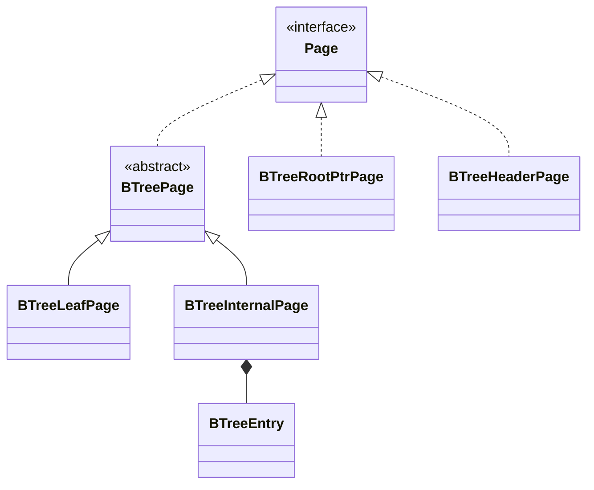
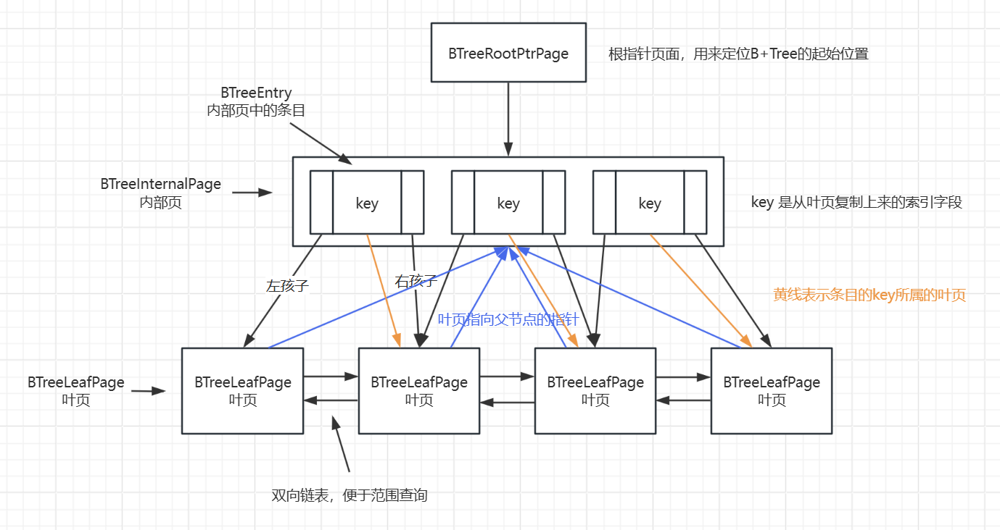
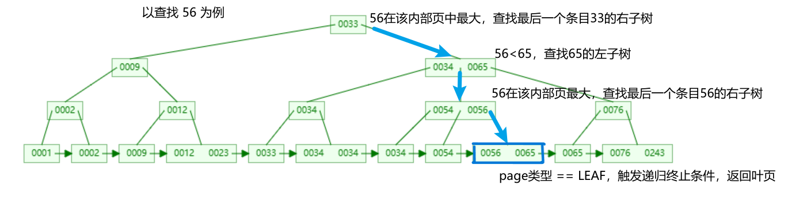
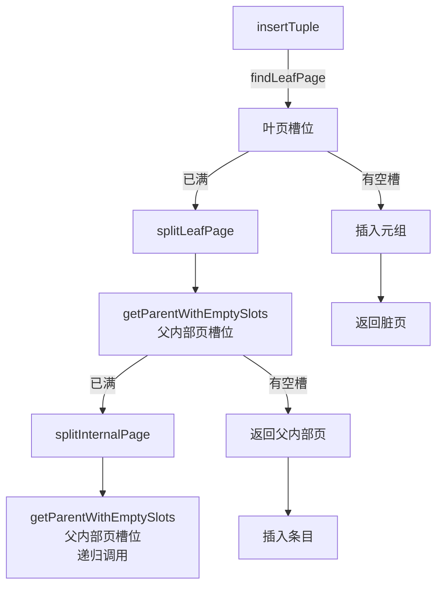
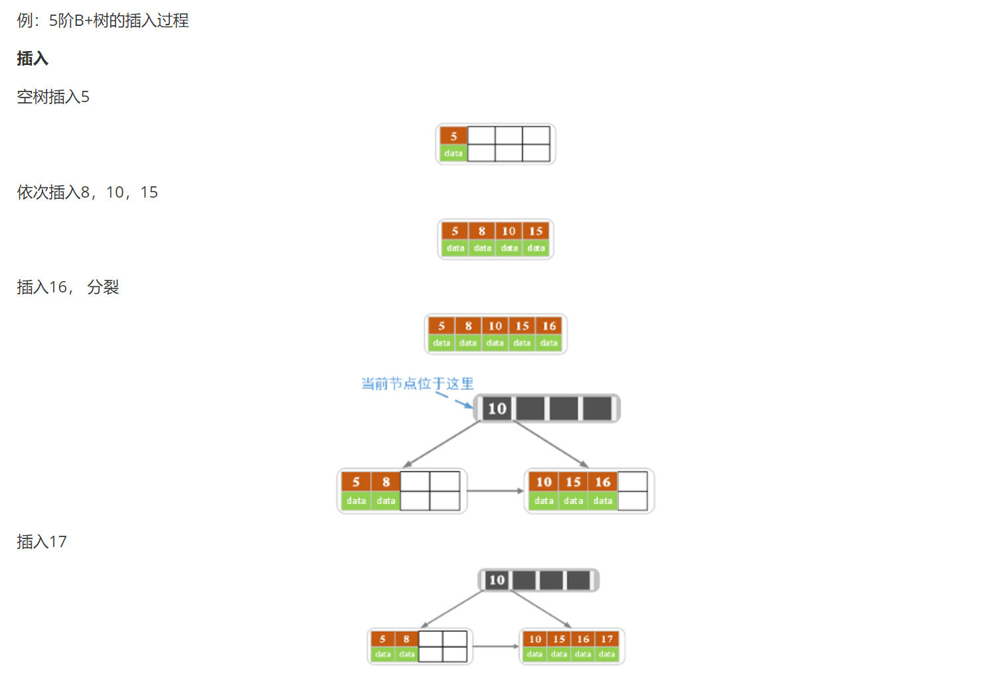
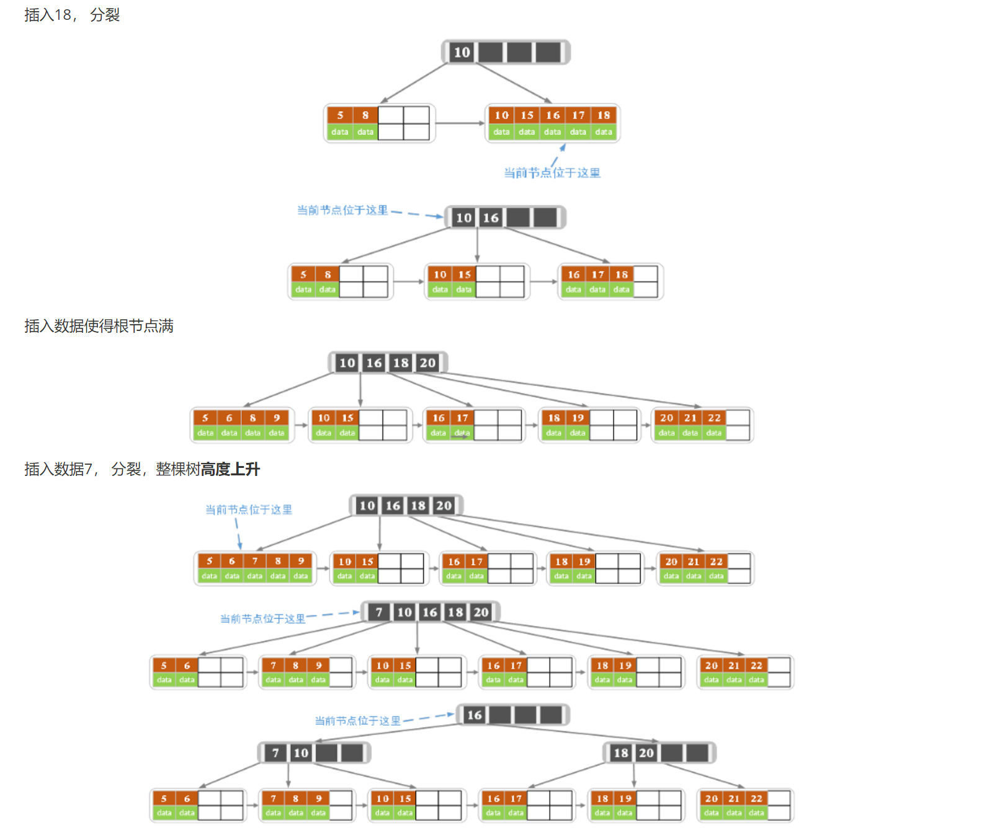
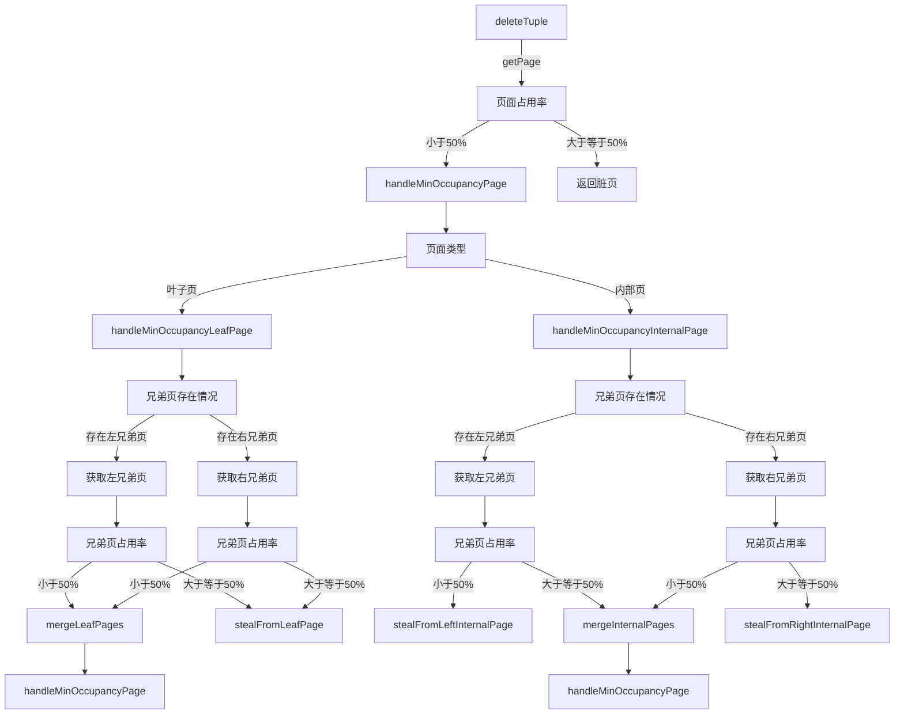
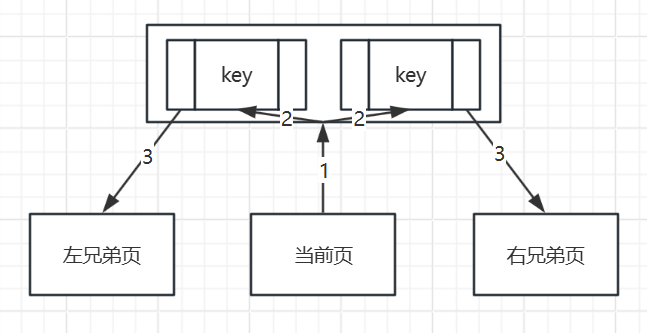
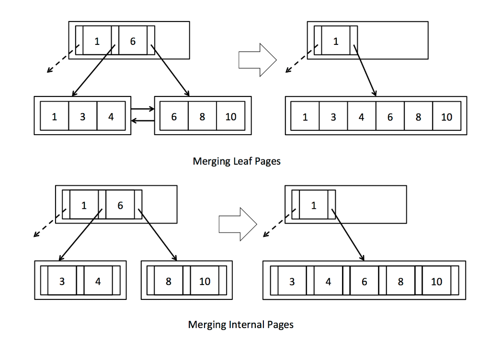
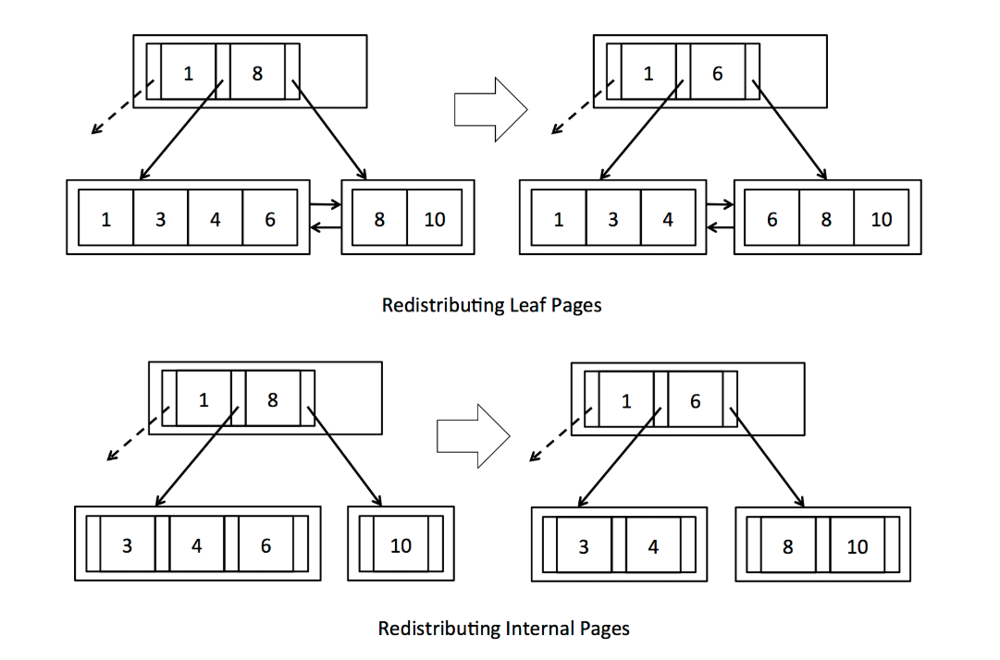

# Lab5 B+树索引实现

Lab5 实现基于 B+ 树的元组增删。

课程代码已经提供实现树形结构所需的所有底层代码和很多辅助方法，自己只需实现几个核心方法即可。

参考链接

[MIT 6.830 Database Systems Lab5 zhihu.com](https://zhuanlan.zhihu.com/p/438912793)

[MIT-6.830 Lab5 总结与备忘 thomas-li-sjtu.github.io](https://thomas-li-sjtu.github.io/2022/06/23/Simple-DB-Lab5/)

[数据结构可视化网站 cs.usfca.edu/](https://www.cs.usfca.edu/~galles/visualization/Algorithms.html)

## 为什么选择B+树

问题：如果数据分布不均匀，会导致普通二叉树层数较深。

解决：自平衡的树，解决了数据分布不均匀的问题，减少检索次数。如：AVL 树，红黑树。

问题：这两类树形结构，每个节点只存储一个数据，适合内存 I/O。对于磁盘 I/O 来说，依旧层数较深，检索速度慢。

解决：B 树（多路平衡查找树）。B 树每个节点存储多个数据，树的层数少，磁盘 I/O 次数少。

问题：B 树范围查询效率低下。

解决：B+ 树：

- 由内节点与叶节点组成：
    - 内节点只起到索引数据的作用，不存储数据。
    - 叶节点存储具体数据，节点间有兄弟指针相互连接，形成双向链表，便于范围扫描。

## B+树结构

### 类

BTreeFile：核心文件，负责管理 B+ 树的文件结构。

BTreeFile 由四种不同类型的页面组成：

- BTreePage：B+ 树页面的抽象类，定义了页面的基本操作
    - BTreeInternalPage：内部页，存储多个条目。
        - BTreeEntry：条目，一个键值，两个子节点，指向内部页或叶页。
    - BTreeLeafPage：叶子页，存储具体数据。
- BTreeRootPtrPage：根指针页面，存储指向根节点（B+ 树起始位置）的指针。
- BTreeHeaderPage：头页面，存储元数据。



### 结构图



注意子页与父页间的三类指针。

## findLeafPage

### 递归逻辑

终止条件

```java
// 如果当前页面类型是叶子页面，则直接返回该叶子页面
if (pid.pgcateg() == BTreePageId.LEAF){
	return (BTreeLeafPage) getPage(tid, dirtypages, pid, perm);
}
```

递归逻辑

```java
// 遍历内部页面的条目
while (it.hasNext()){
	entry = it.next();
	// 如果未指定索引字段（f==null），默认递归查找左子树
	if (f == null){
		return findLeafPage(tid, dirtypages, entry.getLeftChild(), perm, f);
	}
	// 如果当前条目键值 >= f，则递归查找当前条目的左子树
	if (entry.getKey().compare(Op.GREATER_THAN_OR_EQ, f)){
		return findLeafPage(tid, dirtypages, entry.getLeftChild(), perm, f);
	}
}
// 如果f大于所有条目键值，则递归查找内部页中最后一个条目的右子树
return findLeafPage(tid, dirtypages, entry.getRightChild(), perm, f);
```

### 示例



## insertTuple

### 方法调用



### 示例

图片来源：[MIT 6.830 Database Systems Lab5 zhihu.com MorningStar](https://zhuanlan.zhihu.com/p/438912793)





### 代码细节

分裂页面时

- **元组转移**：通过页面的迭代器实现。
- **指针更新**：
    - 更新分裂后涉及的三类指针：
        - 子页指向父页的指针。
        - 条目本身所属的子页。
        - 条目指向左右孩子节点的指针。
- **脏页处理**：
    - 调用方法前，初始化一个 Map 专门用来存储脏页。
    - 每次递归过程中，将涉及到的三个页（分裂出的两个页和父页）加入脏页 Map 中。
    - `BufferPool.insertTuple` 中统一对脏页进行处理。

## deleteTuple

### 方法调用



**流程**

`deleteTuple`，第一遍必然走的是叶子页分支。

`mergeLeafPages` 会删除内部页中的一个条目，随后递归调用 `handleMinOccupancyPage` 处理内部页。

`mergeInternalPages` 同理。

**如何获取叶页与内部页的兄弟页？**

1. 获取当前页的父内部页。
2. 遍历父内部页的条目，找到与当前页关联的两个条目。
3. 左条目的左孩子就是当前页的左兄弟页，右兄弟页同理。



**为什么叶页不用链表获取兄弟页？**

不知道，课程代码是这样提供的，我猜是为了统一叶页与内部页获取兄弟页的逻辑。

### 合并页面

兄弟页占用率小于 50%，合并两页面。

页面合并后，父内部页会减少一个条目。

检查条目减少后父页面的占用率，如果不足 50%，则递归调用 `handleMinOccupancyPage`。



### 重新分配页面

兄弟页占用率大于等于 50%，有多余元组。

将兄弟页的多余元组转移到当前页面中，$转移的元组数 = \frac{二者元组和}{2}-当前页面元组数$。



### 代码细节

合并或重新分配页面时

- **元组转移**：通过页面的迭代器实现。
- **指针更新**：
    - 更新分裂后涉及的三类指针：
        - 子页指向父页的指针。
        - 条目本身所属的子页。
        - 条目指向左右孩子节点的指针。
- **脏页处理**：
    - 调用方法前，初始化一个 Map 专门用来存储脏页。
    - 每次递归过程中，将涉及到的页（合并或重新分配的子页与父页）加入脏页 Map 中。
    - `BufferPool.deleteTuple` 中统一对脏页进行处理。

## 其他

> 为什么删除元组时不需要调用 findLeafPage 查找叶页？

插入元组时，由于不知道该元组应当插入哪个页面，所以需要 findLeafPage 根据 Tuple 索引值，从根节点递归查找叶页。

删除元组时，元组的 RecordId 中已经记录了该元组所属的 PageId，直接调用 getPage 即可获取对应叶页。

> B+ 树查询在 SimpleDB 中是怎么用的？

BTreeFileEncoder 中根据用户传入的命令行参数，决定是否使用 B+ 树查询。

> 进阶

[cmu15445 f22 lecture08 tree-indexes note](https://15445.courses.cs.cmu.edu/fall2022/notes/08-trees.pdf)

Lab 实现的是最基本的东西，还有很多进阶知识，cmu 的讲义里写的很清晰。
