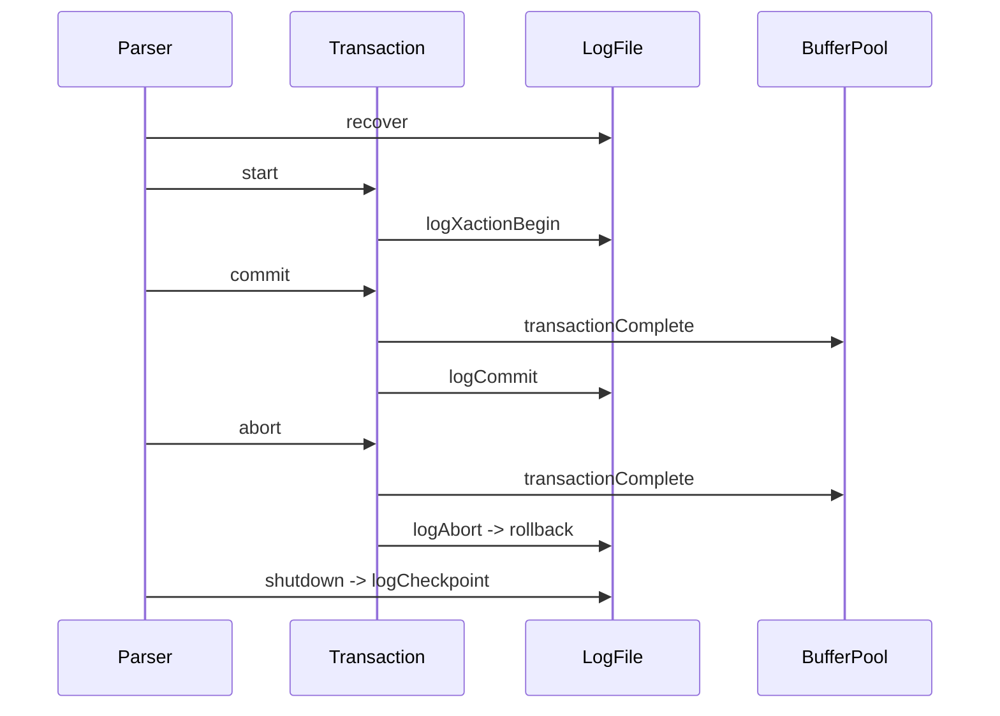

# Lab6 ARIES恢复算法

Lab6 实现 ARIES 的 WAL 与三阶段恢复过程。

实验提供的代码，已经定义了日志文件格式，实现了大部分 I/O 操作。

参考链接

[MIT-6.830 Lab6 总结与备忘 thomas-li-sjtu.github.io](https://thomas-li-sjtu.github.io/2022/06/24/Simple-DB-Lab6/)

[cmu15445 f22 lecture19 Logging Schemes note](https://15445.courses.cs.cmu.edu/fall2022/notes/19-logging.pdf)

[cmu15445 f22 lecture21 Database Crash Recovery note](https://15445.courses.cs.cmu.edu/fall2022/notes/20-recovery.pdf)

[周刊（第15期）：图解ARIES论文（上） codedump.info](https://www.codedump.info/post/20220514-weekly-15/)

[周刊（第16期）：图解ARIES论文（下） codedump.info](https://www.codedump.info/post/20220521-weekly-16/)

**什么是 ARIES ？**

Algorithms for Recovery and Isolation Exploiting Semantics，基于语义的恢复与隔离算法。

由 IBM 研究院发明，现如今被广泛使用。

三个主要原则：

- WAL：预写日志。
- 重做时恢复历史：在数据库崩溃重启后，基于三阶段恢复过程（分析、重做、撤销），将系统恢复到崩溃前的状态。
- 撤销时记录更改：在执行回滚时，回滚本身所作的修改也要写进日志（被称为 CLR），避免二次崩溃重复执行。SimpleDB 中未实现。

[维基百科](https://en.wikipedia.org/wiki/Algorithms_for_Recovery_and_Isolation_Exploiting_Semantics)

**优化**

Lab6 已经实现 WAL 与三阶段恢复（分析、redo、undo）的关键逻辑了，但是 BufferPool 依旧是 `NO-STEAL/FORCE` 策略，感觉很割裂。

所以我按照 ARIES 的理论知识，将其优化为了 `STEAL/NO-FORCE` 策略。

更改如下：

- 缓冲池可以淘汰脏页。（`STEAL`）
- 提交事务后不必立即将脏页刷新进磁盘。（`NO-FORCE`）
- 在 `Parser` 的开头与结尾分别调用 `LogFile` 的 `recover` 与 `shutdown` 方法。
- 添加 `BufferPool.flushCommitedPages` 方法，刷新所有缓冲池中未被事务持有的脏页，替换掉 `logCheckpoint` 中的 `flushAllPages`。
- 修改 `Transaction.transactionComplete` 与 `BufferPool.transactionComplete`：
    - 无论事务提交还是中止，`BufferPool.transactionComplete` 只负责预写日志。
    - `Transaction.transactionComplete` 中，先调用 `BufferPool.transactionComplete` 预写日志，再根据参数执行 `LogFile.logCommit` 或 `logFile.logAbort`。

**SimpleDB 的简化**

- 页级锁，仅需实现页的撤销与重做即可。
- 只实现了物理 Undo，未实现逻辑 Undo。
    - 物理 Undo：根据日志记录的数据，从物理层面还原数据页。
        - 优点：简单。
        - 缺点：恢复粒度较粗。例如 B+ 树索引，假设插入元组时触发 B+ 树的多个页面分裂，则回滚时需要进行大量磁盘 I/O。
    - 逻辑 Undo：从操作层面逆向执行原有事物的变更。例如事务执行是 Insert，回滚就将 Insert 逆向为 Delete 执行。
        - 优点：恢复粒度细，适合索引等复杂场景。
        - 缺点：实现复杂。
- 没有维护后台线程，调用 `logCheckpoint` 不定时清日志刷盘。
    - 此处因为后台线程清日志刷盘时会阻塞写入事务，影响用户体验。因此又涉及到了 LSN 策略。

## 复习

> 在最开始，当然要知道事务是什么？如何使用？以 MySQL 为例。

**什么是事务？**

事务是一系列操作的集合，要保证集合同时成功或同时失败。

**如何使用？**

事务分为自动提交与手动提交。

MySQL 中如果不手动开始事务，则默认为自动提交。

自动提交：MySQL 每执行一条 SQL，自动在语句执行前开始一个事务，并在语句执行完毕后，根据执行情况，立即提交或回滚该事务。

手动提交：

- 开始事务：`START TRANSACTION`/`BEGIN`
- 结束事务：`COMMIT`/`ROLLBACK`

## 基本概念

**存储类型**

- 易失性：内存
- 非易失性：硬盘

**故障分类**

- 事务失败
- 系统故障

**崩溃恢复**

Undo（撤销）：清除未提交或已中止事务的影响。

Redo（重做）：为保持持久性，重新应用已提交事务的影响。

**缓冲池管理策略**

steal：允许未提交事务的相关脏页写入磁盘。

no steal：反之。

force：每次事务提交时，将所有受相关脏页写入硬盘。

no force：反之。

**为什么叫 steal？**

例如事务 A 尝试从硬盘读取数据，但是缓冲池已经被其他事务的工作填满，因此缓冲池需要将一些未提交的事务涉及的页面写入磁盘中。因此称之为窃取，相当于从其他事务那里窃取缓冲池空间。（[参考链接](https://stackoverflow.com/questions/33218564/difference-between-steal-no-steal-and-force-no-force-policies-in-database-recove)）

**策略组合**

| 策略             | 运行时效率 | 恢复时效率 | 实现     |
| ---------------- | ---------- | ---------- | -------- |
| `NO-STEAL/FORCE` | 慢         | 快         | 影子分页 |
| `STEAL/NO-FORCE` | 快         | 慢         | ARIES    |

**其他**

binlog 和两阶段提交主要用在分布式。

## 日志

### 类型

- `ABORT_RECORD`：中止记录。
- `COMMIT_RECORD`：提交记录。
- `UPDATE_RECORD`：更新记录。
- `BEGIN_RECORD`：开始记录。
- `CHECKPOINT_RECORD`：检查点记录。

### 文件结构

- `ABORT_RECORD`：`[类型ID][事务ID][起始偏移量]`
- `COMMIT_RECORD`：`[类型ID][事务ID][起始偏移量]`
- `UPDATE_RECORD`：`[类型ID][事务ID][before-image][after-image][起始偏移量]`
- `BEGIN_RECORD`：`[类型ID][事务ID][起始偏移量]`
- `CHECKPOINT_RECORD`：`[类型ID][事务ID（默认-1）][活跃事务信息][起始偏移量]`
    - `[活跃事务信息]`：`[活跃事务数量][[事务ID][该事务起始偏移量]...]`

起始偏移量就是该事务 `BEGIN_RECORD` 类型记录在文件中的位置，每个事务在文件中最早的位置，便于检查点进行截断。

## WAL

ARIES 采用 `NO-FORCE` 策略，在事务提交后，并不会立即将脏页写入磁盘。

问题：如果系统崩溃，缓冲池中的脏页会丢失，导致数据不一致。

解决：在事务提交前，将事务相关脏页的事务 ID、修改前数据、修改后数据写入日志文件中。以便在系统崩溃后可以恢复数据。

这就是预写日志机制。

## 正常执行

### 事务提交

体现了 `NO-FORCE` 策略。

事务提交后并不会将脏页刷新到磁盘中。因为每次提交事务刷新磁盘，消耗性能过大。

脏页依旧保留在缓冲池中被使用，如果长时间未被使用，LRU 缓存淘汰策略会自动将其刷新进磁盘。

数据库正常退出后，会调用 `BufferPool.flushCommittedPages` 方法，未被事务持有的脏页，被刷新进磁盘。

### 事务中止

体现了 `STEAL` 策略。

WAL 会事先将页被修改前后的数据写入日志。

当事务中止时，调用 `LogFile.rollback` 方法。

- LogFile 会缓存活跃事务的 ID 与起始偏移量。
- rollback 先根据缓存中的偏移量，将文件指针定位到事务 `BEGIN_RECORD` 类型记录的位置。
- 遍历后续日志，如果是 `UNDATE_RECORD` 类型且属于当前事务，则提取日志中的旧数据，将其写入磁盘。
- 淘汰缓冲池中的相关脏页。

## 检查点

**目的**

1. 刷新脏页。
2. 截断不必要的日志。

**文件结构**

`[类型ID][事务ID（默认-1）][活跃事务信息][起始偏移量]`

其中 `[活跃事务信息]` 的详细结构：`[活跃事务数量][[事务ID][该事务起始偏移量]...]`

**实现**

LogFile 维护着所有活跃事务（已开始但尚未提交或终止的事务）的 ID 与起始偏移量。

检查点遍历所有活跃事务起始偏移量，找到其中最小的起始偏移量。

随后将最小起始偏移量之后的文件内容写入新文件中，将旧文件删除，完成不必要日志记录的截断。

**检查点记录写入活跃事务信息的作用？**

加速恢复？暂时不理解。

## 三阶段恢复

假设数据库崩溃：

- 对于已经提交事务，脏页在内存中丢失。数据库恢复后，应当需要将日志中修改后的页写入磁盘。
- 对于其余事务，执行到一半，数据库恢复后应当进行回滚。

`LogFile.recover`

先创建三个缓存结构，分别缓存：

- 活跃事务中存在 `COMMIT_RECORD` 类型记录的事务 ID。后面以 `committedId `代称。
- `UPDATE_RECORD` 类型记录的 before-image。
- `UPDATE_RECORD` 类型记录的 after-image。

### 分析

- LogFile 会缓存活跃事务的 ID 与起始偏移量。
- rollback 先根据缓存中的偏移量，将文件指针定位到事务 `BEGIN_RECORD` 类型记录的位置。
- 随后循环遍历每个事务，从每个事务的起始偏移量开始向后遍历。
- 将遍历过程中 `COMMIT_RECORD` 记录的事务 ID 与 `UPDATE_RECORD` 中的 before-image、after-image 分别记录在三个缓存结构中。

### 重做

循环遍历所有存在于 `committedId` 中的事务。

将与该事务相关的所有 after-image 刷新到磁盘中。完成提交。

### 撤销

循环遍历所有不存在于 `committedId` 中的事务。

将与该事务相关的所有 before-image 刷新到磁盘中。完成回滚。

## 实现

