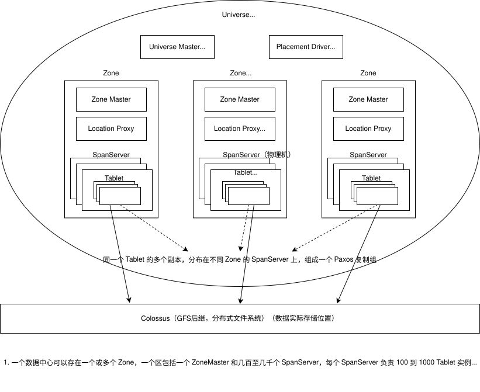
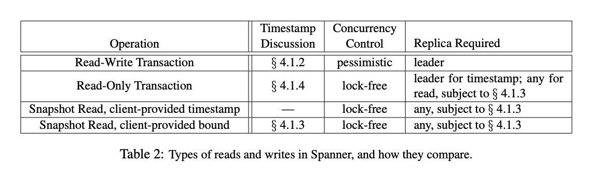

# 论文阅读 Spanner

## 引言

[Spanner: Google's Globally-Distributed Database (OSDI 2012)](https://static.googleusercontent.com/media/research.google.com/zh-CN//archive/spanner-osdi2012.pdf)

很喜欢这篇论文，把分布式和数据库领域的很多知识整合了起来，包括分布式中的时钟漂移、共识算法、线性一致性、分布式事务，数据库中的事务模型 2PL 与 MVCC。从学习的角度考虑，读懂这篇论文大有裨益。

先讲讲时代背景，关系型数据库有着方便的 SQL 语言、ACID 事务支持，但是扩展性不佳。于是谷歌抛弃了 SQL 和跨行事务，可无限扩展的 MapReduce、GFS、BigTable 开启了大数据时代。但是开发人员终究希望使用便捷的 SQL 和强一致的事务，因此既支持无限扩展，又支持 SQL 和强一致事务的 Spanner 就诞生了。

## 架构

Spanner 是能够跨洲际容错的数据库，论文先介绍了 Spanner 的架构和 SpanServer 的软件栈，我把这部分内容画到了一张图中。

剩下的内容是一些细节：

- 每一个 Paxos Leader 都有锁表和事务管理器。
- Tablet 内部还有目录的抽象。目录是数据放置的单元，不同于 BigTable，Spanner Tablet 内可以有多个不同键区间的目录，方便将经常一起访问的目录放到一起以优化性能。
- 实现了半关系型数据库。并通过表交错指令，允许开发者将逻辑相关的表放在一起以优化性能。

## TrueTime

Spanner 认为自己最关键的特性是 TrueTime，工程实现方面我没有看懂，理论方面 Lamport 的 Time Clocks 论文进行过阐释，虽然世界上不存在两个完全相同的时钟，但是通过校对算法能够计算出时钟间的误差范围。

Spanner 做到了这一点，并提供了三个核心 API。最重要的是 `TT.now()`，为开发者提供了时钟的误差范围，`TT.after(t)` 和 `TT.before(t)` 是 `TT.now()` 的上层封装。

## 事务支持

这一节论文开始介绍 Spanner 支持的各个事务操作，在此之前，先回顾一下单机数据库的事务操作。

单机数据库中，事务一般通过 MVCC 实现。事务可以被分为两类，快照读（select）和当前读（insert、delete、update、select ... for update）。快照读与当前读并发执行时，快照读读的是旧版本数据，如此解决了读写冲突的问题。多个当前读并发执行时，通过类似 2PL 的悲观锁机制，解决写写冲突的问题。

Spanner 的读写事务相当于上面提到的当前读，只读事务相当于上面提到的快照读。另外两类事务是 Spanner 根据自身多版本特性的扩展，指定精确时间戳读历史版本，指定时间戳范围读历史版本。

### 读写事务

> 主要涉及论文 4.1.2 与 4.2.1

从这里开始介绍 TrueTime 在 Spanner 中起到的作用。先介绍一下 2PC 的问题：2PC 能够保证事务的原子性，但是由于时钟漂移，无法保证两个事务的时间戳符合线性一致性。

对于读写事务，为了实现线性一致性，Spanner 规定了两个必须满足的条件：Paxos 内的写操作时间戳必须单调递增；事务 T1 提交之后，事务 T2 才开始，那么事务 T2 时间戳必须大于 T1。

Spanner 通过 2PL 与 2PC 实现读写事务。事务时间戳的分配时机为获取所有锁后，释放任何锁前。具体实现中，Spanner 指定一个 Paxos 复制组为协调者，在准备阶段，2PC 的参与者向协调者发送准备时间戳，协调者为该事务选择的提交时间戳必须大于所有参与者的准备时间戳，并在 `TT.after(提交时间戳) == true` 时才进入提交阶段。

### 只读事务

> 主要涉及论文 4.1.3

在介绍只读事务前，先介绍一下标准的 Raft 算法。

标准 Raft 算法中，如果要确保线性一致性，所有读写请求必须由 Leader 进行处理。Follower 只是 Leader 的副本，数据可能滞后。如果允许 Follower 处理读请求，客户端可能会读到旧数据，违反线性一致性。

Spanner 为了提高性能，做了 Follower 读的优化，通过类似 MVCC 多版本副本的方式实现。能够做到这一点，主要也是得益于 TrueTime 为每个事务提供的符合线性一致性的时间戳。

只读事务的重点在于 $t_{safe}$：如果 $t_{read}$（读请求的时间戳）小于 $t_{safe}$，那么就能够直接使用 Follower 中的数据，否则阻塞等待，直到 $t_{safe}$ 大于读请求时间戳（出自 4.1.4）。

$t_{safe} = min(t_{safe}^{Paxos}, t_{safe}^{TM})$

- $t_{safe}^{Paxos}$ 是 Paxos 复制组中的最后一个已完成的读写事务时间戳。
- $t_{safe}^{TM} = min_i(s_{i,g}^{perpare}) - 1$，$t_{safe}^{TM}$ 是当前已准备但未提交的读写事务的最小时间戳的前一刻。

如此能够保证 $t_{safe}$ 时间戳内不会遗漏任何已提交事务，$t_{read}<t_{safe}$ 的只读事务能在 Follower 读到满足线性一致性的数据。

### 其他

4.2.1 如何减少 2PC 的广域网往返次数的优化、4.1.4 和 4.2.2 为快照事务分配时间戳的优化方案、4.2.3 如何实现数据库模式变更、Paxos 相关、未来改进，这些部分我没有细看。

## 结语

TrueTime 是论文的核心，为读写事务实现线性一致性，也为高吞吐的只读事务提供了基石。论文中还有一些性能优化，比如将关联访问的数据尽可能在物理上放在一起、优化 2PC，目的都是尽可能减少网络往返次数以提高性能。在相关工作章节中，作者也提到比起分层的实现，Spanner 集成多个层更有优势，能够做更好的性能优化。

实现一个支持可扩展性与一致性事务的数据库在理论上似乎并不难，正确的时钟、共识算法容错、分片扩展、2PL 与 MVCC 实现事务。Spanner 通过 TrueTime、基于 TrueTime 的工程实现与优化，证明这样的系统在性能上也可接受。

